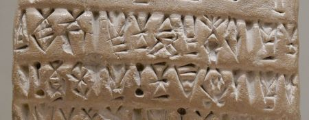

import ScriptDetails from '../../../../components/ScriptDetails.astro';
import WsList from '../../../../components/WsList.astro';
import ArticlesList from '../../../../components/ArticlesList.astro';
import SourceLinksList from '../../../../components/SourceLinksList.astro';
import BibList from '../../../../components/BibList.astro';
import Attribution from '/src/components/Attribution.astro';
import CaptionText from '/src/components/CaptionText.astro';

<CaptionText text="Economic tablet with numeric signs and Proto-Elamite script, from the Tell of the Acropolis in Susa."/>
<Attribution
    type="Image"
    copyholder="Marie-Lan Nguyen"
    copyurl=""
    copyyears="2009"
    license="CC BY 2.5"
    licenseurl="https://creativecommons.org/licenses/by/2.5/deed.en"
    author=""
    source="Wikimedia"
    sourceurl="https://commons.wikimedia.org/wiki/File:Economic_tablet_Susa_Louvre_Sb3047.jpg"
/>

## Script details

<ScriptDetails />

## Script description

Writing in the state of Elam, in modern-day southwest Iran, took three forms.

Read the full description...
Proto-Elamite is the oldest of the three, and was used between 3100-2900 BC. It has not been deciphered but consists of more than 1,000 signs and is thought to be partly logographic. The other two writing systems in Elam were Linear Elamite and Elamite Cuneiform.

## Languages that use this script

<WsList script='Pelm' wsMax='5' />

## Unicode status

The Proto-Elamite script is not yet in Unicode. The script has a tentative allocation at U+1BD00..U+1C37F in the [Roadmap to the SMP](http://www.unicode.org/roadmaps/smp/) for the Unicode Standard.

- [Full Unicode status for Proto-Elamite](/scrlang/unicode/pelm-unicode)

## Resources

<ArticlesList tag='script-pelm' header='Related articles' />

<SourceLinksList tag='script-pelm' header='External links' entrytype='online' />

<BibList tag='script-pelm' header='Bibliography' entrytype='non-online' />

