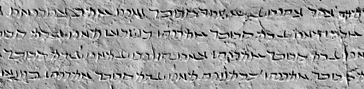

import ScriptDetails from '../../../../components/ScriptDetails.astro';
import ScriptResources from '../../../../components/ScriptResources.astro';
import WsList from '../../../../components/WsList.astro';

## Script details

<ScriptDetails />

## Script description

Inscriptional Pahlavi is the earliest of the three forms of the Pahlavi script, used regularly as a monumental script from the 2nd century BC until the 5th century AD.

Read the full description...
Later forms of the script were called Psalter Pahlavi and Book Pahlavi. Psalter Pahlavi is so far attested in only two sources, so the bulk of our knowledge is related to the other two forms. The names of these, Inscriptional and Book Pahlavi are somewhat misleading; the Inscriptional form was used on monuments, coins, seals and amulets, as would be expected, but the Book form was also used on stone monuments, as well as in manuscript texts. The distinction then refers to whether the letters were connected (Book Pahlavi) or unconnected (Inscriptional Pahlavi) rather than to distinct uses of either form.

The three forms of Pahlavi writing were used with significant overlap from the 2nd century BC until the 9th century AD. Pahlavi writing was the principle means of writing the Middle Iranian languages. It was derived from the Imperial Aramaic script used in the Achaemenid (Persian) empire, and was written from right to left. Words were usually separated by a dot. The script has proved difficult for modern-day paleographers to decipher due to confusion between some similar-looking signs, for example _w_, _n_, and _r_, and due to some signs representing multiple sounds. Only consonants were written.

A well-documented characteristic of Pahlavi writing was the use of _heterograms_ (also called _word masks_ or _Aramaeograms_). These were words which were written in the Aramaic language but pronounced as the appropriate Iranian-language word. For example word 'son' was written using the letters BRḪ, after the Aramaic word for son, _breh_ but pronounced as the Middle Iranian word _pus_.

Inscriptional Pahlavi employed nineteen symbols to represent sounds, plus script-specific symbols to represent the numbers 1, 10, 20, 100 and 1000, which could be combined to write other numbers.

Inscriptional Pahlavi letters provided the basis for the Avestan script.

## Languages that use this script

<WsList script='Phli' wsMax='5' />

## Unicode status

In The Unicode Standard, Inscriptional Pahlavi script implementation is discussed in [Chapter 10 Middle East-II — Ancient Scripts](https://www.unicode.org/versions/latest/core-spec/chapter-10/#G28741).

- [Full Unicode status for Inscriptional Pahlavi](/scrlang/unicode/phli-unicode)

## Resources

<ScriptResources detailSummary='seemore' />

