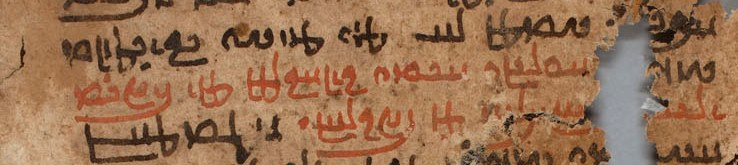

import ScriptDetails from '../../../../components/ScriptDetails.astro';
import WsList from '../../../../components/WsList.astro';
import ArticlesList from '../../../../components/ArticlesList.astro';
import SourcesList from '../../../../components/SourcesList.astro';
import BibList from '../../../../components/BibList.astro';

## Script details

<ScriptDetails />

## Script description

Psalter Pahlavi was one of three forms of the ancient Pahlavi script, used for writing the Middle Iranian languages.

Read the full description...
Psalter Pahlavi has so far only been attested in two sources, a 7th century manuscript of the Psalms of David (hence its name) and an inscription on a bronze cross found at Herat (in present-day Afghanistan). The lack of surviving material in this form of the script has left a number of gaps in modern-day scholars' understanding of Psalter Pahlavi writing.

Pahlavi writing was used from the 2nd century BC until the 7th century AD. It was derived from the form of the Aramaic script used in the Achaemenid (Persian) empire, modified to accommodate the larger consonantal inventory of the Middle Iranian languages. It was written from right to left, and words were separated by a dot. The script has proved difficult for modern-day paleographers to decipher due to confusion between some similar-looking signs, for example _w_, _n_, and _r_, and due to some signs representing multiple sounds. Only consonants were written.

A well-documented characteristic of Pahlavi writing was the use of _heterograms_ (also called _word masks_ or _Aramaeograms_). These were words which were written in the Aramaic language but pronounced as the appropriate Iranian-language word. For example the word ' son' was written using the letters BRḪ, after the Aramaic word for son, _breh_ but pronounced as the Middle Iranian word _pus_.

The Psalter Pahlavi script was written from right to left, using 18 letters. These exhibited fully-developed joining behaviour; some letters could join on the left or the right and others could join on the right only. Script-specific numbers were used for the numbers 1, 2, 3, 4, 10, 20, and 100. Other numbers were made by adding these together so that 130 was written using the symbols for 100, 'and' _waw_, 20, and 10. Numbers below 100 did not use the 'and' _waw_ symbol. Numbers as well as letters were cursive, and could join both to other numbers and - in the case where _waw_ was used - to letters.

Four punctuation marks were used in Psalter Pahlavi, apparently to indicate semantic breaks. One of these was used at the beginning and the end of a text and at various points within it, but its exact purpose is unclear. Two were combining marks, one above and one below. The fourth was a full stop.

## Languages that use this script

<WsList script='Phlp' wsMax='5' />

## Unicode status

In The Unicode Standard, Psalter Pahlavi script implementation is discussed in [Chapter 10 Middle East-II — Ancient Scripts](https://www.unicode.org/versions/latest/core-spec/chapter-10/#G28804).

- [Full Unicode status for Psalter Pahlavi](/scrlang/unicode/phlp-unicode)

## Resources

<ArticlesList tag='script-phlp' header='Related articles' />

<SourcesList tag='script-phlp' header='External links' entrytype='non-online' />

<BibList tag='script-phlp' header='Bibliography' entrytype='non-online' />

