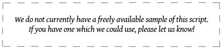

import ScriptDetails from '../../../../components/ScriptDetails.astro';
import ScriptResources from '../../../../components/ScriptResources.astro';
import WsList from '../../../../components/WsList.astro';

## Script details

<ScriptDetails />

## Script description

Book Pahlavi is one of the three forms of Pahlavi writing, along with Inscriptional and Psalter Pahlavi.

Read the full description...
Psalter Pahlavi is so far attested in only two sources, so the bulk of our Pahlavi knowledge is related to the other two forms. The names of these, Inscriptional and Book Pahlavi are somewhat misleading; the Inscriptional form was used on monuments, coins, seals and amulets, as would be expected, but the Book form was used in manuscript texts as well as on stone monuments. The distinction then refers to whether the letters were connected (Book Pahlavi) or unconnected (Inscriptional Pahlavi) rather than to distinct uses of either form.

Pahlavi writing was the principal means of writing the Middle Iranian languages. It was derived from the Imperial Aramaic script used in the Achaemenid (Persian) empire, and was written from right to left. Words were usually separated by a dot. The script has proved difficult for modern-day paleographers to decipher due to confusion between some similar-looking signs, for example _w_, _n_, and _r_, and due to some signs representing multiple sounds. Pahlavi also employed a number of logograms - a single sign which represented a whole word or meaningful segment of a word. Most of the surviving Pahlavi texts pertain to the Zoroastrian religion; texts from the same period pertaining to the Manichaean religion were written in the Manichaean script.

A well-documented characteristic of Pahlavi writing was the use of _heterograms_ (also called _word masks_ or _Aramaeograms_). These were words which were written in the Aramaic language but pronounced as the appropriate Iranian-language word. For example the word 'son' was written using the letters BRḪ, after the Aramaic word for son, _breh_ but pronounced as the Middle Iranian word _pus_. Some estimates suggest that up to half the words in any given Book Pahlavi text may have been written using heterograms. Verbal roots written in this way were commonly combined with inflectional endings written phonetically.

Book Pahlavi was in common use from the 3rd century BC until the 9th century AD, after which it was used only as a secret language by Zoroastrian religious leaders. It is a cursive script. Book Pahlavi used twelve letters to represent twenty-three consonants. Later forms of the script used diacritics to distinguish between different interpretations of ambiguous letters. The letter _aleph_ was also used in this form of Pahlavi writing to represent the 'long a' vowel. A number of ligatures were used, some of which were identical in shape to either simplex or combined forms of other letters.

## Languages that use this script

<WsList script='Phlv' wsMax='5' />

## Unicode status

The Book Pahlavi script is not yet in Unicode. The script has a tentative allocation at U+10BB0..U+10BDF in the [Roadmap to the SMP](http://www.unicode.org/roadmaps/smp/) for the Unicode Standard.

- [Full Unicode status for Book Pahlavi](/scrlang/unicode/phlv-unicode)

## Resources

<ScriptResources detailSummary='seemore' />

