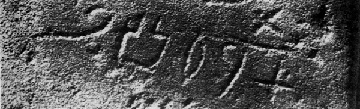

import ScriptDetails from '../../../../components/ScriptDetails.astro';
import WsList from '../../../../components/WsList.astro';
import ArticlesList from '../../../../components/ArticlesList.astro';
import SourceLinksList from '../../../../components/SourceLinksList.astro';
import BibList from '../../../../components/BibList.astro';

## Script details

<ScriptDetails />

## Script description

Proto-Sinaitic uses a set of pictographic signs which are believed to have been derived from Egyptian Hieroglyphs.

Read the full description...
The earliest inscriptions date from between the 16th and 19th centuries BC. The script is a consonantal alphabet, and it is considered to be the first attested independent writing system of this type.

## Languages that use this script

<WsList script='Psin' wsMax='5' />

## Unicode status

The Proto-Sinaitic script is not yet in Unicode. The script has a tentative allocation at U+108B0..U+108DF in the [Roadmap to the SMP](http://www.unicode.org/roadmaps/smp/) for the Unicode Standard.

- [Full Unicode status for Proto-Sinaitic](/scrlang/unicode/psin-unicode)

## Resources

<ArticlesList tag='script-psin' header='Related articles' />

<SourceLinksList tag='script-psin' header='External links' entrytype='online' />

<BibList tag='script-psin' header='Bibliography' entrytype='non-online' />
