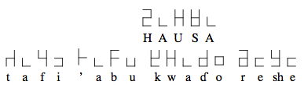
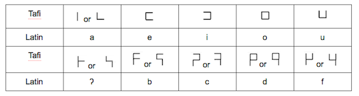

import ScriptDetails from '../../../../components/ScriptDetails.astro';
import ScriptResources from '../../../../components/ScriptResources.astro';
import WsList from '../../../../components/WsList.astro';

## Script details

<ScriptDetails />

## Script description

The Tafi script was proposed in the 1970s for writing the Hausa language.

Read the full description...
“Tafi” in Hausa means “palm” (of the hand). The script was originally based around five signs called “digits” (as in “fingers”, not to be confused with numerical digits) which can be joined in pairs to represent twenty-five consonants. Alone, each digit represents one of the vowels a, e i, o or u. So the first five consonant letters - ʔ, b, c, d and f - are created by attaching the _a_ digit to the bottom of each of the five digits as shown in the table below. The first digit can be attached to either the right of the left of its partner, which means that each of the first five consonants can be written in two ways.

Consonants 6 to 10 - g, ‘y, h, j, and k - are written by appending the _e_ digit directly below each of the five digits, and so the pattern continues.

Proponents of the script suggest that this system be categorized as “digital writing” as opposed to a regular alphabet. However in terms of word formation the script functions as an alphabet.

Tafi is written from left to right. Vowels are not written word-initially; rather, the glottal stop ʔ character precedes any word-initial vowels, as in Arabic. Case is not normally used, but where a capital letter is deemed necessary, the writer can either enlarge the size of the letter or place a circumflex (&#x005E;) over it.

Later versions of the script include six vowel “digits” which can combine to represent thirty-six consonants. This enables it to be used for the Igbo and Yoruba languages also.

_This script is not currently recognized by the [ISO 15924 standard](http://www.unicode.org/iso15924/), but is included in ScriptSource for research purposes. If you have any information on this script, please add the information to this site. Your contributions can be a great help in refining and expanding the ISO 15924 standard. The [Script Encoding Initiative](http://www.linguistics.berkeley.edu/sei/) is working to support the inclusion of this script in the standard, and contributions here will support their efforts._

## Languages that use this script

<WsList script='Qa18' wsMax='5' />

## Unicode status

The Tafi (Hausa) script is not yet in Unicode. The script has not yet been added to the [Roadmap to the SMP](http://www.unicode.org/roadmaps/smp/) for the Unicode Standard.

- [Full Unicode status for Tafi](/scrlang/unicode/qa18-unicode)

## Resources

<ScriptResources detailSummary='seemore' />

