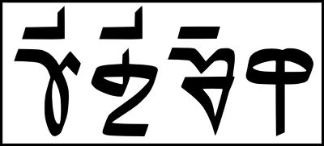

import ScriptDetails from '../../../../components/ScriptDetails.astro';
import WsList from '../../../../components/WsList.astro';
import ArticlesList from '../../../../components/ArticlesList.astro';
import SourcesList from '../../../../components/SourcesList.astro';
import BibList from '../../../../components/BibList.astro';

## Script details

<ScriptDetails />

## Script description

Tikamuli is one of two scripts used specifically for writing the Sunuwar language spoken in Nepal and Sikkim.

Read the full description...
Tikamuli is used primarily in Nepal, and [Sunuwar](/scrlang/scripts/sunu) (or Jenticha) is used primarily in Sikkim. In both places, Sunuwar can also be written in the [Devanagari](/scrlang/scripts/deva) script.

Tikamuli is named after its inventor, Tikaram Mulicha. It is not genetically related to any other scripts, although some letters appear to have been based on the shapes of [Limbu](/scrlang/scripts/limb) and [Lepcha](/scrlang/scripts/lepc) letters.

The script is an abugida; every consonant contains an inherent vowel, which can be modified by appending vowel diacritics to the consonant or silenced by adding a _virama_ below the consonant. There is also one independent vowel letter which represents /ə/. Word-initial vowels are written with this letter and a vowel diacritic if appropriate.

Vowel length marks are also used. Any written consonant can carry up to one vowel diacritic and one vowel length mark.

Tikamuli uses script-specific digits from 0-9, and Latin punctuation.

_This script is not currently recognized by the [ISO 15924 standard](http://www.unicode.org/iso15924/), but is included in ScriptSource for research purposes. If you have any information on this script, please add the information to this site. Your contributions can be a great help in refining and expanding the ISO 15924 standard. The [Script Encoding Initiative](https://sei.berkeley.edu/) is working to support the inclusion of this script in the standard, and contributions here will support their efforts._

## Languages that use this script

<WsList script='Qa19' wsMax='5' />

## Unicode status

The Tikamuli script is not yet in Unicode. The script has a tentative allocation at U+16C80..U+16CBF in the [Roadmap to the SMP](http://www.unicode.org/roadmaps/smp/) for the Unicode Standard.

- [Full Unicode status for Tikamuli](/scrlang/unicode/qa19-unicode)

## Resources

<ArticlesList tag='script-qa19' header='Related articles' />

<SourcesList tag='script-qa19' header='External links' entrytype='non-online' />

<BibList tag='script-qa19' header='Bibliography' entrytype='non-online' />

