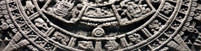

import ScriptDetails from '../../../../components/ScriptDetails.astro';
import ScriptResources from '../../../../components/ScriptResources.astro';
import WsList from '../../../../components/WsList.astro';

## Script details

<ScriptDetails />

## Script description

Aztec Pictograms were used by the Nahua peoples in central Mexico for writing the Nahuatl language.

Read the full description...
This writing system is considered a proto-writing system as opposed to a fully-formed script, partly because it was not able to communicate everything that could be expressed verbally in the language and partly because there were only a few signs whose form and use were constrained by convention. Aside from these, each scribe would decide for himself which signs would best represent the ideas he wished to convey. For this reason there is no set corpus of signs and the number of signs used is unknown.

Signs were largely ideographic in nature; concepts related to movement were represented using trails of footprints, death was represented by a corpse wrapped in burial cloths, and speech was represented by a scroll issuing from the speaker’s mouth. Colour was also used semantically to distinguish between similar-looking signs, such as those for canes, rushes and grass, or to indicate a person’s royal standing.

_This script is not currently recognized by the [ISO 15924 standard](http://www.unicode.org/iso15924/), but is included in ScriptSource for research purposes. If you have any information on this script, please add the information to this site. Your contributions can be a great help in refining and expanding the ISO 15924 standard. The [Script Encoding Initiative](http://sei.berkeley.edu/) is working to support the inclusion of this script in the standard, and contributions here will support their efforts._

## Languages that use this script

<WsList script='Qa26' wsMax='5' />

## Unicode status

The Aztec Pictograms are not yet in Unicode. At one point the script had a tentative allocation in the [Roadmap to the SMP](http://www.unicode.org/roadmaps/smp/) for the Unicode Standard. However, it is no longer in the roadmap.

- [Full Unicode status for Aztec Pictograms](/scrlang/unicode/qa26-unicode)

## Resources

<ScriptResources detailSummary='seemore' />

