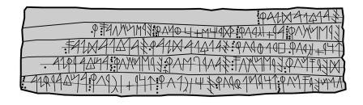

import ScriptDetails from '../../../../components/ScriptDetails.astro';
import WsList from '../../../../components/WsList.astro';
import ArticlesList from '../../../../components/ArticlesList.astro';
import SourcesList from '../../../../components/SourcesList.astro';
import BibList from '../../../../components/BibList.astro';

## Script details

<ScriptDetails />

## Script description

The Paleohispanic (Iberian) scripts were a family of scripts used for writing the Iberian language, spoken along the present-day French, Spanish and Portuguese coasts during the first and second centuries.

Read the full description...
There were two main variants of Paleohispanic writing. The Northeastern (or Levantine) variant is the script in which 95% of extant texts are written. It was used as far north as southern France but primarily in Catalonia, Aragonia, and Valencia, and was written from left to right. The Southeastern (or Meridional) variant was used in eastern Andalusia, Murcia, Albacete, Alicante and Valencia, and was written from right to left.

The Paleohispanic scripts are thought to be unique in the way they were structured. They contained features of both alphabetic and syllabic scripts. [Continuants](/reference/glossary#continuant) (i.e. sounds made without complete closure of the vocal tract such as fricatives, sonorants and vowels) were written with alphabetic letters, and any following vowel had to be written with a separate letter. Non-continuants,(i.e. [stops](/reference/glossary#stop)) however, were written with syllabic glyphs that represented a consonant + vowel combination.

Some scholars also classify Greco-Iberian writing as a Paleohispanic script. It was used in Alicant and Murcia and was written from left to right. It was directly adapted from the Greek alphabet for use with the Iberian language, and does not share the same structural features with the Northeastern and Southeastern varieties.

_This script is not currently recognized by the [ISO 15924 standard](http://www.unicode.org/iso15924/), but is included in ScriptSource for research purposes. If you have any information on this script, please add the information to this site. Your contributions can be a great help in refining and expanding the ISO 15924 standard. The [Script Encoding Initiative](https://sei.berkeley.edu/) is working to support the inclusion of this script in the standard, and contributions here will support their efforts._

## Languages that use this script

<WsList script='Qa37' wsMax='5' />

## Unicode status

- [Unicode status for Northern Palaeohispanic](/scrlang/unicode/z-no-palaeohispanic-unicode)
- [Unicode status for Southern Palaeohispanic](/scrlang/unicode/z-so-palaeohispanic-unicode)

## Resources

<ArticlesList tag='script-qa37' header='Related articles' />

<SourcesList tag='script-qa37' header='External links' entrytype='non-online' />

<BibList tag='script-qa37' header='Bibliography' entrytype='non-online' />

