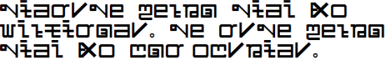

import ScriptDetails from '../../../../components/ScriptDetails.astro';
import ScriptResources from '../../../../components/ScriptResources.astro';
import WsList from '../../../../components/WsList.astro';

## Script details

<ScriptDetails />

## Script description

The Tani script, also called Tani Lipi, is a left-to-right  alphabetic script consisting of twenty-six letters.

Read the full description...
It has limited use in the state of Arunachal Pradesh, India amongst speakers of the Tani sub-family of Tibeto-Burman languages.

The script was invented by Tony Koyu in 2001. It has no genetic relationship to any other writing system, although the shapes of some letters resemble those of Bengali and Latin.

_This script is not currently recognized by the [ISO 15924 standard](http://www.unicode.org/iso15924/), but is included in ScriptSource for research purposes. If you have any information on this script, please add the information to this site. Your contributions can be a great help in refining and expanding the ISO 15924 standard. The [Script Encoding Initiative](https://sei.berkeley.edu/) is working to support the inclusion of this script in the standard, and contributions here will support their efforts._

## Languages that use this script

<WsList script='Qa51' wsMax='5' />

## Unicode status

The Tani script is not yet in Unicode. The script has a tentative allocation at U+114E0..U+114FF in the [Roadmap to the SMP](http://www.unicode.org/roadmaps/smp/) for the Unicode Standard.

- [Full Unicode status for Tani](/scrlang/unicode/qa51-unicode)

## Resources

<ScriptResources detailSummary='seemore' />

