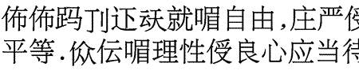

import ScriptDetails from '../../../../components/ScriptDetails.astro';
import ScriptResources from '../../../../components/ScriptResources.astro';
import WsList from '../../../../components/WsList.astro';

## Script details

<ScriptDetails />

## Script description

The Zhuang Square script (also called Sawndip or Fāngkuài Zhuàngzì) is a logographic script previously used for writing Zhuang, a northern Tai language still spoken by about 10 million people in China.

Read the full description...
It is not known whether this script is still in use; some scholars claim it is extinct whilst others claim it is still used in rural areas. The present official script for writing Zhuang is [Latin](/scrlang/scripts/latn).

The Zhuang Square  script is made up of a combination of Chinese characters, Chinese-like characters, and symbols borrowed from other scripts such as the [Latin](/scrlang/scripts/latn) alphabet and (possibly) [Myanmar](/scrlang/scripts/mymr). There is only one dictionary published in Zhuang Square script; this lists 10,000 characters.

_This script is not currently recognized by the [ISO 15924 standard](http://www.unicode.org/iso15924/), but is included in ScriptSource for research purposes. If you have any information on this script, please add the information to this site. Your contributions can be a great help in refining and expanding the ISO 15924 standard. The [Script Encoding Initiative](https://sei.berkeley.edu/) is working to support the inclusion of this script in the standard, and contributions here will support their efforts._

## Languages that use this script

<WsList script='Qa52' wsMax='5' />

## Unicode status

At the publication of Version 6.0, no proposal had been submitted to include the Zhuang Square script in the Unicode Standard.

- [Full Unicode status for Zhuang Square](/scrlang/unicode/qa52-unicode)

## Resources

<ScriptResources detailSummary='seemore' />

