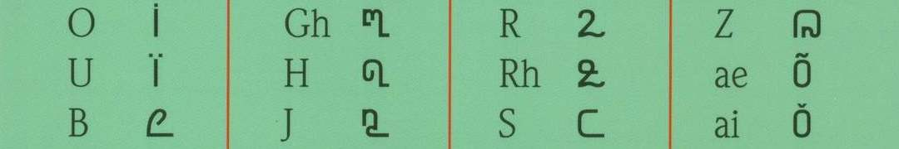

import ScriptDetails from '../../../../components/ScriptDetails.astro';
import WsList from '../../../../components/WsList.astro';
import ArticlesList from '../../../../components/ArticlesList.astro';
import SourcesList from '../../../../components/SourcesList.astro';
import BibList from '../../../../components/BibList.astro';

## Script details

<ScriptDetails />

## Script description

Coorgi-Cox script was created by the German linguist, Gregg Cox.

Read the full description...
He formally introduced this script in April 2005. It was developed to write the [Kodava language](https://www.ethnologue.com/language/kfa), which is also referred to as Coorgi. Coorgi-Cox is comprised of eight vowels, 26 consonants and a double vowel marker. Each letter represents a different sound.  

The Kodava language is classified as a Dravidian language that is specifically used in the Kodagu district, or Coorg region, of the Karnataka state in India. Since no traditional written script exists for the Kodava language, Kannada script and the Coorgi-Cox script are used. Currently, there is widespread debate as to whether switching from Kannada script to Coorgi-Cox script would be beneficial or whether switching to a Latin alphabet based writing system would be more useful.

_This script is not currently recognized by the [ISO 15924 standard](http://www.unicode.org/iso15924/), but is included in ScriptSource for research purposes. If you have any information on this script, please add the information to this site. Your contributions can be a great help in refining and expanding the ISO 15924 standard. The [Script Encoding Initiative](https://sei.berkeley.edu/) is working to support the inclusion of this script in the standard, and contributions here will support their efforts._

## Languages that use this script

<WsList script='Qa68' wsMax='5' />

## Unicode status

The Coorgi-Cox alphabet is not yet in Unicode. It is not yet in the Roadmap for the Unicode Standard.

- [Full Unicode status for Coorgi-Cox](/scrlang/unicode/qa68-unicode)

## Resources

<ArticlesList tag='script-qa68' header='Related articles' />

<SourcesList tag='script-qa68' header='External links' entrytype='non-online' />

<BibList tag='script-qa68' header='Bibliography' entrytype='non-online' />

