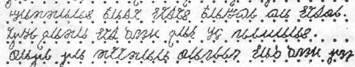

import ScriptDetails from '../../../../components/ScriptDetails.astro';
import ScriptResources from '../../../../components/ScriptResources.astro';
import WsList from '../../../../components/WsList.astro';

## Script details

<ScriptDetails />

## Script description

The Kaddare script is also referred to as the Kaddariya script.

Read the full description...
It was created in the 1950s by Xuseen Sheekh Axmed Kaddare to write the Somali language.  

The Kaddare script was considered the best indigenous script to write Somali by the 1961 linguistic commission, which was established by the Somali government, and the 1966 UNESCO commission. However, the Latin-based orthography was the top choice, and became the official script in 1972.

Kaddare makes use of upper and lower case letters, where the lower case letters are written in cursive so as not to lift the pen.

_This script is not currently recognized by the [ISO 15924 standard](http://www.unicode.org/iso15924/), but is included in ScriptSource for research purposes. If you have any information on this script, please add the information to this site. Your contributions can be a great help in refining and expanding the ISO 15924 standard. The [Script Encoding Initiative](http://www.linguistics.berkeley.edu/sei/) is working to support the inclusion of this script in the standard, and contributions here will support their efforts._

## Languages that use this script

<WsList script='Qa75' wsMax='5' />

## Unicode status

The Kaddare script is not yet in Unicode. It is not yet in the Roadmap for the Unicode Standard.

- [Full Unicode status for Kaddare](/scrlang/unicode/qa75-unicode)

## Resources

<ScriptResources detailSummary='seemore' />

