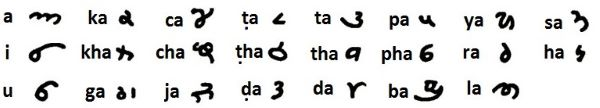

import ScriptDetails from '../../../../components/ScriptDetails.astro';
import WsList from '../../../../components/WsList.astro';
import ArticlesList from '../../../../components/ArticlesList.astro';
import SourcesList from '../../../../components/SourcesList.astro';
import BibList from '../../../../components/BibList.astro';

## Script details

<ScriptDetails />

## Script description

Lahnda (also Landa) was a Brahmi-derived script used in the Punjab and Sindh regions of what are now India and Pakistan from around the 10th to the early 20th centuries.

Read the full description...
The script was known as a merchants' script, although it was also used for literature and administrative purposes. Despite being widely used, Lahnda was never standardized, nor its regional variants unified, so there is significant variation in the styles used in different areas. The many varieties are sometimes classified into two broad groups, 'Punjabi' and 'Sindhi'.  
The script has now been supplanted by Arabic and Devanagari writing, although its successor, the Gurmukhi script, is widely used throughout the Punjab. 

_This script is not currently recognized by [ISO 15924](http://www.unicode.org/iso15924/), but is included in ScriptSource for research purposes. If you have any information on this script, please add the information to the site. Your contributions can be a great help in refining and expanding the ISO 15924 standard._

## Languages that use this script

<WsList script='Qaaj' wsMax='5' />

## Unicode status

The Lahnda (sometimes called Landa) script is not yet in Unicode. The script has a tentative allocation at U+11250..U+1127F in the [Roadmap to the SMP](http://www.unicode.org/roadmaps/smp/) for the Unicode Standard.

- [Full Unicode status for Lahnda](/scrlang/unicode/qaaj-unicode)

## Resources

<ArticlesList tag='script-qaaj' header='Related articles' />

<SourcesList tag='script-qaaj' header='External links' entrytype='non-online' />

<BibList tag='script-qaaj' header='Bibliography' entrytype='non-online' />
