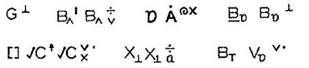

import ScriptDetails from '../../../../components/ScriptDetails.astro';
import ScriptResources from '../../../../components/ScriptResources.astro';
import WsList from '../../../../components/WsList.astro';

## Script details

<ScriptDetails />

## Script description

Stokoe Notation was developed in 1960 by William Stokoe for writing American Sign Language (ASL), and later adapted for writing British and Australian Aboriginal Sign Languages.

Read the full description...
It was the first _phonemic_ script created for writing a signed language, although it was not created for the Deaf to write down their language for daily use, and it never came to be used for this purpose. Rather, it has always been used for linguistic research and analysis.

Until the 1960s, signed languages were not viewed as “real” languages but as simple mimes with no consistent linguistic structure. Stokoe’s aim in creating his script was to demonstrate that American Sign Language was built up from the same elements as spoken languages. Spoken languages are analysed in terms of segments (for example phonemes) and features (the elements that make up a phoneme such as voicing, place of articulation, vowel height etc). Stokoe Notation demonstrates that signed languages can be analysed in the same terms. The segments are signs instead of sounds, and the features are hand shape, location with respect to the body, orientation, and direction of movement.

The script is neither a logography (which generally represent nothing smaller than a morpheme), nor a syllabary (which generally represent nothing smaller than a syllable) nor an alphabet (which generally represent nothing smaller than a phoneme). Rather, Stokoe Notation represents each feature of each segment. There are three types of symbols. In representing a given sign, the location symbol is written first, then the handshape symbol, then the orientation/direction symbol. So the three components in  ͜ 5x, which represents the sign meaning _mother_, are ‘‘⏝’, indicating that the sign is made with the hand at the chin,  '5', indicating that it uses a spread hand, and 'x' indicating that the thumb touches the chin.

The fifty-five symbols used in Stokoe’s original script are based on the shapes of Latin letters, punctuation, and numbers. The script has not been standardized, and has been adapted for use with various signed languages, so some consider it a family of related scripts, rather than a single script. Stokoe dubbed the three types of symbols tab ("tabula" or sign location), dez ("designator" or handshape &amp; orientation ), and sig ("signification" or motion &amp; action). Symbols are written in strict tab-dez-sig: TD_S_ order.

Stokoe Notation has been criticized for not distinguishing between sharp and soft manner of movement or between tenseness and laxness, nor representing uneven rate of signing or facial expression, all of which are salient elements of ASL. The script is also not equipped to handle ASL pronouns.

_This script is not currently recognized by [ISO 15924](http://www.unicode.org/iso15924/), but is included in ScriptSource for research purposes. If you have any information on this script, please add the information to the site. Your contributions can be a great help in refining and expanding the ISO 15924 standard._

## Languages that use this script

<WsList script='Qaaq' wsMax='5' />

## Unicode status

The Stokoe Notation is not yet in Unicode. The script has not yet been added to the [Roadmap to the SMP](http://www.unicode.org/roadmaps/smp/) for the Unicode Standard. It may end up being unified with the Latin script.

- [Full Unicode status for Stokoe Notation](/scrlang/unicode/qaaq-unicode)

## Resources

<ScriptResources detailSummary='seemore' />

