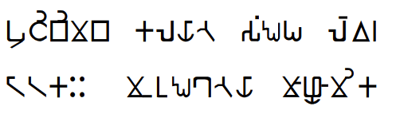

import ScriptDetails from '../../../../components/ScriptDetails.astro';
import WsList from '../../../../components/WsList.astro';
import ArticlesList from '../../../../components/ArticlesList.astro';
import SourceLinksList from '../../../../components/SourceLinksList.astro';
import BibList from '../../../../components/BibList.astro';

## Script details

<ScriptDetails />

## Script description

This script is likely an appropriation of [Brahmi](/scrlang/scripts/brah).

_This script is suspected to be one way that the Eastern Magar language is written. _

Read the full description...
It is not currently recognized by [ISO 15924](http://www.unicode.org/iso15924/), but is included in ScriptSource for research purposes. If you have any information on this script, please add the information to the site. Your contributions can be a great help in refining and expanding the ISO 15924 standard.

## Languages that use this script

<WsList script='Qabl' wsMax='5' />

## Unicode status

- [Unicode status for Magar Akkha](/scrlang/unicode/z-magar-akkha-unicode)

## Resources

<ArticlesList tag='script-qabl' header='Related articles' />

<SourceLinksList tag='script-qabl' header='External links' entrytype='online' />

<BibList tag='script-qabl' header='Bibliography' entrytype='non-online' />
