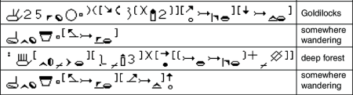

import ScriptDetails from '../../../../components/ScriptDetails.astro';
import ScriptResources from '../../../../components/ScriptResources.astro';
import WsList from '../../../../components/WsList.astro';

## Script details

<ScriptDetails />

## Script description

The Hamburg Sign Language Notation System, or HamNoSys, was first developed by a group of hearing and deaf people in 1985.

Read the full description...
It is currently in its fourth revision. Unlike the other scripts for writing signed languages, HamNoSys is not intended as a practical writing tool for everyday communication. Rather, its purpose is analogous to that of the International Phonetic Alphabet, which is used to transcribe the sounds of any given spoken language in a consistent way. In the same way, HamNoSys is based on the phonology of signed languages and designed with the capacity to transcribe every natural signed language in the world using consistent symbols across languages.

HamNoSys is an alphabet, written using 210 largely iconic characters. Based on Stokoe’s 4-parameter model, characters represent hand shape, hand orientation, location relative to other parts of the body, and movement. Each sign (or word) must be written by assigning a value to each of these parameters. Unlike Stokoe’s model, HamNoSys also provides a symmetry operator for representing symmetrical two-handed signs, and a limited number of non-manual components. Non-manual phonological elements can be represented in part by replacing the hand grapheme with the symbol for another body part, such as the head. The parameters of a sign are written in the following order:

- Symmetry Operator
- Non-manual Components
- Handshape
- Hand Position
- Location
- Movement

Smaller facial movements such as raised eyebrows or puffed out cheeks are more complex to represent. They can be written on another tier, synchronised to the master manual tier. HamNoSys has been criticised for not adequately representing facial expression, which forms a crucial part of the phonology of many signed languages. Work is underway to develop a more comprehensive system for representing this.

_This script is not currently recognized by [ISO 15924](http://www.unicode.org/iso15924/), but is included in ScriptSource for research purposes. If you have any information on this script, please add the information to the site. Your contributions can be a great help in refining and expanding the ISO 15924 standard._

## Languages that use this script

<WsList script='Qabn' wsMax='5' />

## Unicode status

HamNoSys is not yet in Unicode. The script has not yet been added to the [Roadmap to the SMP](http://www.unicode.org/roadmaps/smp/) for the Unicode Standard.

- [Full Unicode status for HamNoSys](/scrlang/unicode/qabn-unicode)

## Resources

<ScriptResources detailSummary='seemore' />

