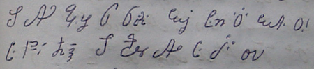

import ScriptDetails from '../../../../components/ScriptDetails.astro';
import WsList from '../../../../components/WsList.astro';
import ArticlesList from '../../../../components/ArticlesList.astro';
import SourcesList from '../../../../components/SourcesList.astro';
import Bibliography from '../../../../components/Bibliography.astro';

## Script details

<ScriptDetails />

## Script description

The Eskaya script is used for writing the [Eskayan](https://scriptsource.org/lang/esy) language, an artificial language associated with the Eskaya people of the Philippines.

Read the full description...
There is considerable controversy surrounding both the people and their language and script. Since coming to the attention of the wider world in the 1980s, neither has been extensively studied, and this lack of factual knowledge has led to speculation and numerous theories about their origins. These range from the supernatural to suggestions that the Eskaya are a cult or simply an impoverished tribe that concocted a “lost language” in order to attract government attention and funding. None of these theories has ever been proven.

The Eskaya people speak the [Cebuano](https://scriptsource.org/lang/ceb) language in their day-to-day lives, and there is no evidence that the Eskayan language has ever had any mother-tongue speakers. It is used primarily for songs, prayers, teaching, traditional literature, some public signage, and to exclude non-Eskayas from a conversation. The language and script are said to have been created by a man known as Pinay, the ancestor of the Eskaya people, but it is unclear whether this is myth or historical fact. They were revived by a rebel soldier, Mariano Datahan,  who founded a utopian community in the Bohol region of the Philippines in the early 20th century and taught them to his followers. A few speakers claim that Pinay and Datahan were in fact one and the same person; others, that they lived a few hundred years apart. Because so little is known about the history of the people, it is impossible to verify either of these claims. Both the language and the script continue to be taught in purpose-built schools run by volunteers, where attendance is voluntary but carries some prestige. The little linguistic analysis that has been carried out on the language indicates that it is grammatically Cebuano but with a substituted lexicon. This correlation is so strong that, where there is a set of homophones in Cebuano, the corresponding Eskayan words will also be homophones.

The Eskaya script is of central importance to the Eskaya people, who consider writing to be the “true” form of the language; a written word is not seen as a representation of the spoken form but vice-versa. Similarly, a Cebuano-language text written in the Eskaya script is deemed to be an Eskaya text, but an Eskayan-language text written in the Latin script is not. The script is an alphasyllabary; most characters represent syllables but some represent individual phones. The full character set contains 1,065 characters, but a reduced set of 46 (called the _abidiha_) is considered to be the ‘core’ group, and these are taught first - many of these can be either alphabetic or syllabic, depending on context. Of the syllabic characters, many represent C+V or C+V+C sequences, but some are as complex as C+C+V+C+C. At least one character is trisyllabic.

Unlike many syllabic scripts, there is no universal inherent vowel. Many of the characters in the _abidiha_ have a one-syllable ‘name’ when they are being recited, and this dictates their syllabic value. For example, the character called _bi_ can be used syllabically to represent /bi/, but /i/ cannot be considered the inherent vowel, as the character called _ka_ represents /ka/, the character called _hu_ represents /hu/, and so on.

Many syllabic characters consist of an _inahan_ (‘mother’) - a core vowel element - and a _sinyas_ (‘gesture’) - an [onset](/reference/glossary#onset) or [coda](/reference/glossary#coda) consonant. For example, the syllable /da/ is written with the _a_ character (the 'mother'), with a small closed curl (the 'gesture', representing the /d/ onset) attached to it. However, these cannot be said to be simple vowel+diacritic combinations, as the _sinyas_ is not always predictable or consistent - in other vowel combinations with /d/ the closed curl is replaced by another symbol. 

Some character shapes resemble Latin letters but by and large they are based on the human anatomy. For example, the syllable called _gi_ is written using a concave curve, followed by a dash, followed by a convex curve, which represents the two ears either side of the head. The script is anthropomorphised in other ways also; one text describes the letters doing the human work of planting different edible plants. 

Of the 1,065 characters in the syllabary, some represent sounds which are not attested in the language. The reason for this is unknown, but it may be that the original purpose of the writing system was to transliterate from another writing system - probably Latin - rather than to transcribe a language. 

Eskaya is written from left to right, with words separated by spaces. It uses Latin punctuation, except for the question mark and full stop, which are distinct. Eskaya uses a decimal numeric system, and the script includes symbols for representing 0-9. Some number shapes are based on Latin number shapes, but do not necessarily represent the same numeric value.

_This script is not currently recognized by the [ISO 15924 standard](http://www.unicode.org/iso15924/), but is included in ScriptSource for research purposes. If you have any information on this script, please add the information to this site. Your contributions can be a great help in refining and expanding the ISO 15924 standard. The [Script Encoding Initiative](https://sei.berkeley.edu/) is working to support the inclusion of this script in the standard, and contributions here will support their efforts._

## Languages that use this script

<WsList script='Qabr' wsMax='5' />

## Unicode status

The Eskaya script is not yet in Unicode. The script has a tentative allocation at U+1A300..U+1A75F in the [Roadmap to the SMP](http://www.unicode.org/roadmaps/smp/) for the Unicode Standard. It is also discussed in [UTN 35: Indonesian and Philippine Scripts and extensions](https://www.unicode.org/notes/tn35/).

- [Full Unicode status for Eskaya](/scrlang/unicode/qabr-unicode)

## Resources

<ArticlesList tag='script-qabr' header='Related articles' />

<SourcesList tag='script-qabr' header='External links' />

<Bibliography tag='script-qabr' header='Bibliography' />

