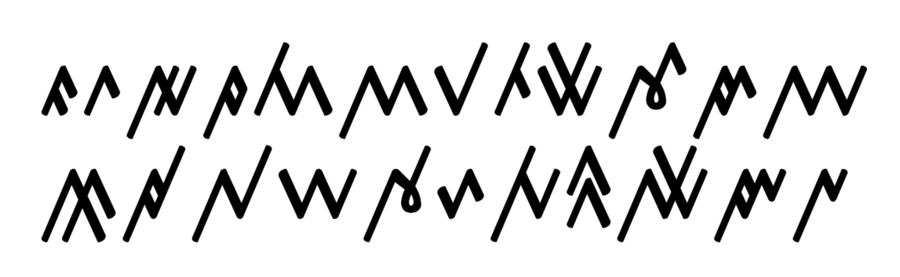

import ScriptDetails from '../../../../components/ScriptDetails.astro';
import WsList from '../../../../components/WsList.astro';
import ArticlesList from '../../../../components/ArticlesList.astro';
import SourceLinksList from '../../../../components/SourceLinksList.astro';
import BibList from '../../../../components/BibList.astro';

## Script details

<ScriptDetails />

## Script description

The Rejang (also known as the Kaganga or Redjang) script is used to write the 5 Rejang dialects spoken collectively by about 200-250,000 people on the Indonesian island of Sumatra, and the Kerinci and Lampung languages of the same region.

Read the full description...
The script is thought to pre-date the introduction of Islam in the C12th to the area, although the earliest attested document has been dated to the mid C18th. It is traditionally written on bamboo, buffalo horn, bark or copper plates. An abugida of Brahmic derivation, the script comprises 23 consonant letters each with an inherent [a] vowel. Any of 12 diacritics can be used to modify the quality of the vowel. A further diacritic is used to mute the inherent vowel in a consonant-final syllable. The script is somewhat [defective](/reference/glossary#defect) in that it does not allow for the representation of diphthongs, which occur frequently in spoken Rejang. Consonants likewise cannot form clusters.

## Languages that use this script

<WsList script='Rjng' wsMax='5' />

## Unicode status

In The Unicode Standard, Rejang script implementation is discussed in [Chapter 17: Southeast Asia-II — Indonesia and the Philippines](https://www.unicode.org/versions/latest/core-spec/chapter-17/#G27208) and in [UTN 35: Indonesian and Philippine Scripts and extensions](https://www.unicode.org/notes/tn35/).

- [Full Unicode status for Rejang](/scrlang/unicode/rjng-unicode)

## Resources

<ArticlesList tag='script-rjng' header='Related articles' />

<SourceLinksList tag='script-rjng' header='External links' entrytype='online' />

<BibList tag='script-rjng' header='Bibliography' entrytype='non-online' />
