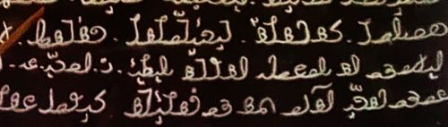

import ScriptDetails from '../../../../components/ScriptDetails.astro';
import WsList from '../../../../components/WsList.astro';
import ArticlesList from '../../../../components/ArticlesList.astro';
import SourcesList from '../../../../components/SourcesList.astro';
import BibList from '../../../../components/BibList.astro';

## Script details

<ScriptDetails />

## Script description

Hanifi Rohingya is one of four scripts used for writing the Rohingya language, spoken by about 1,500,000 people, mostly in Myanmar.

Read the full description...
There are also significant Rohingya-speaking refugee communities in Bangladesh and Thailand.

The Rohingya language has been written in the [Arabic](/scrlang/scripts/arab) script for over 200 years, during which time it has also been written in [Myanmar](/scrlang/scripts/mymr) and a modified Latin script known as Rohingyalish. Around 1960, Rohingya scholars began to see a need for a unique writing system which reflected their own language, and Molana Hanif created the Hanifi Rohingya script.

Hanifi Rohingya is an alphabet written from right to left. The shapes of the characters are based on the Arabic script (though the character shapes in Hanifi Rohingya are not contextual as they are in Arabic), with some influence from Latin and Myanmar. The script is written with twenty-eight consonants, each containing an inherent _a_ vowel, five vowels, and one vowel carrier letter. There is also a separate letter for marking nasalization of vowels.

Rohingya is a tonal language, contrasting oral vs nasal, long vs. short, and falling vs rising tones. Three tone marks exist in the script, which are written above the vowel letter. There is also a diacritic, _shadda_, which marks geminate (long) consonants, and a sign, _sukun_, for indicating the absence of the inherent vowel. Two consonants have alternate final forms; /m/ is always written with its final form at the end of a word instead of with the _ma_ + _sukun_ sequence, and /l/ can be written at the end of a word either with its final form or with the _la_ + _sukun_ sequence.

There is a full set of decimal digits from 0-9, which are written from left to right.

## Languages that use this script

<WsList script='Rohg' wsMax='5' />

## Unicode status

In The Unicode Standard, Hanifi Rohingya script implementation is discussed in [Chapter 16: Southeast Asia-I — Thailand, Laos, Myanmar, Cambodia, Vietnam](https://www.unicode.org/versions/latest/core-spec/chapter-16/#G73728).

- [Full Unicode status for Hanifi Rohingya](/scrlang/unicode/rohg-unicode)

## Resources

<ArticlesList tag='script-rohg' header='Related articles' />

<SourcesList tag='script-rohg' header='External links' entrytype='non-online' />

<BibList tag='script-rohg' header='Bibliography' entrytype='non-online' />
