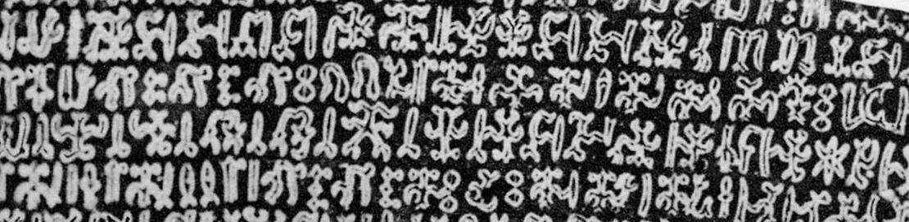

import ScriptDetails from '../../../../components/ScriptDetails.astro';
import ScriptResources from '../../../../components/ScriptResources.astro';
import WsList from '../../../../components/WsList.astro';

## Script details

<ScriptDetails />

## Script description

The Rongorongo script was discovered on Easter Island, in the southeastern Pacific Ocean, in the 19th century.

Read the full description...
It is thought to have been used by speakers of the Rapanui language, but it is not known whether it was a form of writing proper, or whether it was simply a mnemonic device to aid in the memorization of genealogy, liturgy, choreography and other elements of the Easter Islanders’ daily lives.

There are about two dozen extant examples of the script, most of which are in the form of carvings on wooden tablets, now housed in various museums around the world. The script has never been formally deciphered, although there are many speculated interpretations of the texts. It is thought that some of the texts contain calendrical information.

Rongorongo glyphs are in the form of outlines of humans, animals, plants and geometric shapes. Most scholars agree that the glyphs represent a combination of sounds - perhaps syllables - and concepts.

The script is written in reverse [boustrophedon](/reference/glossary#boust) style. The text is read starting at the bottom left-hand corner of the tablet and read towards the right. At the end of the line, the tablet is rotated 180° and the next line (which is now the second line from the top of the tablet) is read, again from left to right. This means that alternate lines are written upside down in relation to one another. If the text is too long to fit onto one side of the tablet, it continues on the back, beginning at the same place it left off on the front. So if there is an odd number of lines on the front of the tablet, the writing on the back will start at the _top_ left-hand corner and be read from left to right and top to bottom.

## Languages that use this script

<WsList script='Roro' wsMax='5' />

## Unicode status

The Rongorongo script is not yet in Unicode.  At one point the script had a tentative allocation in the [Roadmap to the SMP](http://www.unicode.org/roadmaps/smp/) for the Unicode Standard. However, it is no longer in the roadmap.

- [Full Unicode status for Rongorongo](/scrlang/unicode/roro-unicode)

## Resources

<ScriptResources detailSummary='seemore' />

