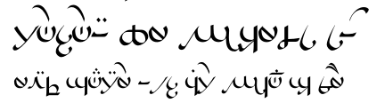

import ScriptDetails from '../../../../components/ScriptDetails.astro';
import WsList from '../../../../components/WsList.astro';
import ArticlesList from '../../../../components/ArticlesList.astro';
import SourcesList from '../../../../components/SourcesList.astro';
import BibList from '../../../../components/BibList.astro';

## Script details

<ScriptDetails />

## Script description

The Sarati script is an artificial script created by J.

Read the full description...
R. R. Tolkien for writing the artificial language, Quenya, which is spoken in the fictional territory of Middle-earth, where many of Tolkien’s novels are set.

Sarati is an abugida. Each letter, called a _sarat_, represents one phoneme. The script is based on consonants, with vowels written as diacritics. The script can be written in any direction, vertically, horizontally or [boustrophedon](/reference/glossary#boust), but is most often written vertically from top to bottom.

Sarati was created partly to provide a history for the better-known [Tengwar](/scrlang/scripts/teng) script, which is claimed to be the descendant of Sarati.

## Languages that use this script

<WsList script='Sara' wsMax='5' />

## Unicode status

The Sarati script is not yet in Unicode. The script is listed in the [Not the Roadmap](http://www.unicode.org/roadmaps/not-the-roadmap/) page. The explanation given is "Known scripts, with enough information, but insufficient reason to provide pre-allocation."

- [Full Unicode status for Sarati](/scrlang/unicode/sara-unicode)

## Resources

<ArticlesList tag='script-sara' header='Related articles' />

<SourcesList tag='script-sara' header='External links' entrytype='non-online' />

<BibList tag='script-sara' header='Bibliography' entrytype='non-online' />
