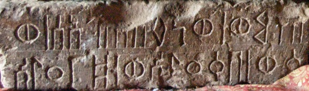

import ScriptDetails from '../../../../components/ScriptDetails.astro';
import ScriptResources from '../../../../components/ScriptResources.astro';
import WsList from '../../../../components/WsList.astro';

## Script details

<ScriptDetails />

## Script description

The Old South Arabian script (also called Musnad, Epigraphic South Arabian, or Sayhadic) was used for writing a group of closely related Semitic languages, all of which are now extinct.

Read the full description...
The script was used throughout the Arabian peninsula, particularly in modern-day Yemen, between the 6th and the 8th centuries AD, after which it was replaced by Arabic writing. It is the forerunner of the modern-day Ethiopic script.

There were two forms of the script; the angular, monumental form is predominant, but in recent years examples have also been found of a more cursive form, inscribed on leather.  These two types are sometimes called _musnad_ and _zabur_ respectively.

Old South Arabian was an abjad; vowels were not indicated in writing. There were twenty-nine consonant letters in the script. In its earlier forms, it was written in [boustrophedon](/reference/glossary#boust) style, with the shapes of letters reversed on alternate lines to be consistent with the direction of writing. However, later examples tend to be written from right to left. Some combinations of letters could be overlaid and rotated to produce ligatures, commonly called monograms. Diacritics were not used for writing Old South Arabian.

Spaces were not left between words; rather a vertical bar symbol was used to separate words.

Apart from the symbol for the number 50, Old South Arabian did not use special symbols for writing digits. Five letters were assigned the numeric values 1, 5, 10, 100 and 1000, and a numeric indicator symbol was written before and after any letters which were intended to be read numerically. For example, the number 10,000 was written as _numeric indicator_ + _letter ayn_ + _letter alef_ + _numeric indicator_, with _ayn_ and _alef_ representing the numbers 10 and 1000, respectively.

## Languages that use this script

<WsList script='Sarb' wsMax='5' />

## Unicode status

In The Unicode Standard, Old South Arabian script implementation is discussed in [Chapter 10 Middle East-II — Ancient Scripts](https://www.unicode.org/versions/latest/core-spec/chapter-10/#G29209).

- [Full Unicode status for Old South Arabian](/scrlang/unicode/sarb-unicode)

## Resources

<ScriptResources detailSummary='seemore' />

