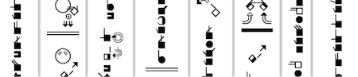

import ScriptDetails from '../../../../components/ScriptDetails.astro';
import ScriptResources from '../../../../components/ScriptResources.astro';
import WsList from '../../../../components/WsList.astro';

## Script details

<ScriptDetails />

## Script description

SignWriting was developed in 1974 by Valerie Sutton, a dancer.

Read the full description...
Two years earlier, Sutton had developed DanceWriting, a notation system for transcribing dance movements. She was asked by Lars von der Lieth, from the University of Copenhagen, to produce something similar for the purpose of writing down signed languages.

SignWriting is written by arranging visually iconic symbols representing the hands, face and body spatially on the page in a way that reflects the movements made by the signer during signing. Words can be written from the point of view of the signer or of the viewer, although they are more commonly written from the point of view of the signer.

A complete sign (or word) consists of multiple graphemes, arranged spatially rather than sequentially. The arrangement, or placement, of graphemes is contrastive; two signs may contain the same graphemes, but their arrangement within the sign determines its meaning.

The script uses a large number of diacritics. These have fixed positioning relative to the base sign but can change shape contextually. For example, the diacritics for shoulder raising and lowering change shape depending on whether they are attached to a torso symbol that is horizontal or shifted.

There are thought to be twenty-seven signed languages which can be written using SignWriting, but only twelve which regularly use the script, including French Sign Language, Norwegian Sign Language, and Brazilian Sign Language. Although other scripts have been created for writing signed languages (for example Stokoe Notation and SignFont Notation), SignWriting is the most widely used. It has been used to print newspapers, magazines, and books in a number of signed languages, as well as teaching materials, both for teaching Sign Language to a novice signer, and for teaching other school subjects to skilled signers .

## Languages that use this script

<WsList script='Sgnw' wsMax='5' />

## Unicode status

- [Full Unicode status for SignWriting](/scrlang/unicode/sgnw-unicode)

## Resources

<ScriptResources detailSummary='seemore' />

