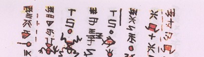

import ScriptDetails from '../../../../components/ScriptDetails.astro';
import WsList from '../../../../components/WsList.astro';
import ArticlesList from '../../../../components/ArticlesList.astro';
import SourcesList from '../../../../components/SourcesList.astro';
import Bibliography from '../../../../components/Bibliography.astro';

## Script details

<ScriptDetails />

## Script description

The Shuishu script (also called Sui) is used by the Shui people in the Guizhou province of China.

Read the full description...
It is mainly used by the Shui religious priests (Shuishu masters) but it is also used for research and documentation. The script is sometimes even incorporated into needlework.

The Shui language contains forty-four consonants, eight vowels, eight diphthongs and eight tones. The characters in the Shuishu script consist of Chinese variants, primitive pictographs and abstract symbols. It is usually written vertically downward and then towards the left without punctuation.

Shuishu has close to 500 characters. Each Shuishu character basically expresses a concept and stands for a syllable.

## Languages that use this script

<WsList script='Shui' wsMax='5' />

## Unicode status

The Shuishu script (also called Sui script) is not yet in Unicode. Shuishu has a tentative allocation at U+1B300..U+1B5FF  in the [Roadmap to the SMP](http://www.unicode.org/roadmaps/smp/) for the Unicode Standard.

- [Full Unicode status for Shuishu](/scrlang/unicode/shui-unicode)

## Resources

<ArticlesList tag='script-shui' header='Related articles' />

<SourcesList tag='script-shui' header='External links' />

<Bibliography tag='script-shui' header='Bibliography' />

