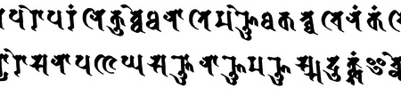

import ScriptDetails from '../../../../components/ScriptDetails.astro';
import WsList from '../../../../components/WsList.astro';
import ArticlesList from '../../../../components/ArticlesList.astro';
import SourceLinksList from '../../../../components/SourceLinksList.astro';
import BibList from '../../../../components/BibList.astro';

## Script details

<ScriptDetails />

## Script description

Siddham is an extinct Brahmic script which was used between 600-1200 AD for writing Sanskrit.

Read the full description...
The script originated in southern India but travelled along the silk road to China, Japan and Korea in the form of Buddhist tantra texts. An adaptation of the script is still used in some esoteric Buddhist schools in Japan, where it is called _Bonji_.

The script is an abugida. Each character indicates a syllable consisting either of an independent (that is, not preceded by a consonant) vowel, or of a consonant followed by the vowel /a/. Diacritic marks can be appended to consonant letters to indicate that a vowel other than /a/ follows. There is also a diacritic mark, the _virama_ to indicate that a consonant stands alone, with no following vowel. Consonant clusters are usually written with special conjunct forms.

## Languages that use this script

<WsList script='Sidd' wsMax='5' />

## Unicode status

In The Unicode Standard, Siddham script implementation is discussed in [Chapter 15: South and Central Asia-IV — Other Historic Scripts](https://www.unicode.org/versions/latest/core-spec/chapter-15/#G80829).

- [Full Unicode status for Siddham](/scrlang/unicode/sidd-unicode)

## Resources

<ArticlesList tag='script-sidd' header='Related articles' />

<SourceLinksList tag='script-sidd' header='External links' entrytype='online' />

<BibList tag='script-sidd' header='Bibliography' entrytype='non-online' />

