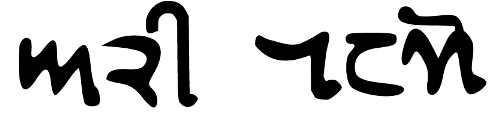

import ScriptDetails from '../../../../components/ScriptDetails.astro';
import ScriptResources from '../../../../components/ScriptResources.astro';
import WsList from '../../../../components/WsList.astro';

## Script details

<ScriptDetails />

## Script description

The Khudawadi (also called Sindhi) script was used for writing the Indo-Aryan Sindhi language spoken by almost 20 million people in the Sindh province of Pakistan and in India.

Read the full description...
It is no longer used. 

The Sindhi language has been written since the 8th century AD, in a number of different scripts. In Pakistan, it is presently written using a modification of the Nastaliq script used for writing Urdu; however the modifications are significant enough that a reader of Urdu cannot necessarily read Sindhi. In India, it is written using a modification of the Devanagari script.

The Brahmic script generally known as the Khudawadi script was based on a number of unstandardized Lahnda scripts used by local merchants around Hyderabad. It was standardized and decreed to be an official script for the Sindhi language in 1868 by the Government of Bombay. The script is an abugida; every consonant letter contains an inherent [ɑ] vowel, which can be modified by writing a vowel diacritic above, below, to the left or to the right of the consonant. Vowels which occur at the start of a word are written using independent vowel letters.

The Khudawadi script is written using sixty-nine letters, including thirty-seven consonants, ten independent vowels, nine vowel diacritics, and a set of digits from 0-9. There are also two non-alphabetic signs; _anusvara_ which is written above a letter to represent nasalization, and _nukta_ which is used for representing sounds non-native to Sindhi. A _virama_ is used for cancelling out the inherent vowel in every consonant letter.

Consonant clusters are written using the virama symbol underneath the first consonant in the cluster. Ligatures and half-letters, commonly used for writing consonant clusters in other South Asian languages, are not used for writing the Khudawadi script.

A combination of Devanagari and Latin punctuation marks is used.

## Languages that use this script

<WsList script='Sind' wsMax='5' />

## Unicode status

In The Unicode Standard, Khudawadi script implementation is discussed in [Chapter 15 South and Central Asia-IV](http://www.unicode.org/versions/latest/ch15.pdf).

- [Full Unicode status for Khudawadi](/scrlang/unicode/sind-unicode)

## Resources

<ScriptResources detailSummary='seemore' />

