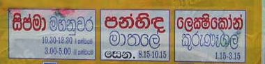
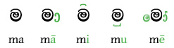
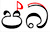

import ScriptDetails from '../../../../components/ScriptDetails.astro';
import ScriptResources from '../../../../components/ScriptResources.astro';
import WsList from '../../../../components/WsList.astro';

## Script details

<ScriptDetails />

## Script description

The Sinhala script is used for writing the Sinhala language, spoken by approximately 15,500,000 people in Sri Lanka, and for transcribing the ancient Pali and Sanskrit languages.The script is derived from Brahmi, and shows close similarities to the Grantha script which was used in southern India until the 16th century. Sinhala is a diglossic language, that is, the spoken and written forms of the language show considerable variation. The main differences are that retroflex [ɭ] and [ɳ] are represented in writing but have assimilated to alveolar [l] and [n] in speech, that three vowel sounds [ə], [a] and [ā] are represented by only two letters, the pronunciation of which is generally predictable from a set of contextual rules, and that there are two letters transcribed ṣ and ś but both pronounced [ʃ]. Additionally, spelling conventions do not always reflect current pronunciation.

There are two forms of the Sinhala script. The standard, 'pure', form which is taught in schools is called _eḷu hōḍiya_ or _śuddha hōḍiya_. This system contains twenty consonant and twenty vowel letters and can be used to represent the sounds of the spoken language almost perfectly. However, to adhere to current spelling conventions - some of which represent archaic pronunciations - and to accurately transcribe Sanskrit, Pali, Hindi and English loanwords, a wider set of letters is needed. This set is called 'mixed alphabet' _miśra hōḍiya_ and contains an additional eighteen consonant letters, many of which are aspirated equivalents of existing letters.

The Sinhala script is an abugida. Each letter represents a consonant+vowel syllable, with the vowel 'a' being inherent in each syllable. This vowel can be changed by means of diacritics written above, below, to the left or to the right of the base consonant, or in a combination of positions. Examples of vowel diacritics with the consonant _m_ are shown below:

There are two additional diacritic marks, both called _hal kirīma_ which can be written above a consonant letter to silence the vowel altogether. The selection of one _hal kirīma_ over the other is determined by the shape of the consonant letter. The _hal kirīma_ with _p_ and _b_ respectively is shown in red below:

Vowels which occur at the start of a word, so not preceded by a consonant, are written with independent vowel letters. Unusually for Indian languages, Sinhala has distinct signs (short and long) for the low front vowel [æ].

Spoken Sinhala is different from most Indian languages in that it uses a set of prenasalized stops which are distinct from nasal+stop combinations, and are represented differently in writing. So there is a single letter for representing the prenasalized sound [ɳɖ] in the word [aɳɖa] 'sound', but in the word [aɳɖa] 'egg', the _ɳ_ and the _ɖ_ are written using two separate letters.

There are some conjunct letters for writing consonant clusters, including [geminates](/reference/glossary#gemination) (long consonants). Generally, these are formed by attaching a full form of the second letter to a truncated form of the first. Some conjuncts are used which are not so easily decomposable into their parts. Special conjunct symbols also exist for combining _r_ either before or after another consonant, and for combining _y_ after a consonant. The _hal kirīma_ sign can also be used to write two consecutive consonants with no intermediate vowel.

A set of Sinhala digits existed, representing numbers 0-9, multiples of 10 up to 100, and the number 1000. However, these are no longer used, having been replaced by Latin digits. The old Sinhala punctuation mark _kunddaliya_, which was previously used as a full stop, has also been supplanted by the Latin punctuation set.

## Languages that use this script

<WsList script='Sinh' wsMax='5' />

## Unicode status

In The Unicode Standard, Sinhala script implementation is discussed in [Chapter 13 South and Central Asia-II — Other Modern Scripts](https://www.unicode.org/versions/latest/core-spec/chapter-13/#G26561).

- [Full Unicode status for Sinhala](/scrlang/unicode/sinh-unicode)

## Resources

<ScriptResources detailSummary='seemore' />

