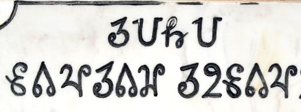

import ScriptDetails from '../../../../components/ScriptDetails.astro';
import ScriptResources from '../../../../components/ScriptResources.astro';
import WsList from '../../../../components/WsList.astro';

## Script details

<ScriptDetails />

## Script description

The Sora Sompeng script is used for writing the Sora language spoken by about 310,000 people in India, predominantly in the eastern state of Orissa.

Read the full description...
Sora is in the Munda language family. It is also sometmes called Saora or Savara, but is not to be confused with the Savara language in the Dravidian family. According to the Ethnologue, Sora (Munda) is given the language code srb, and Savara (Dravidian) is given the language code svr.

There are three scripts which have been created specifically for writing Munda languages; Sora Sompeng for the Sora language, Ol' Chiki for the Santali language, and Varang Kshiti for the Ho language. However, these three scripts are not visually similar and are not derived from a common source, all having been created by influential community leaders to replace non-native scripts.

The Sora language has also been written in an IPA-based script developed by Christian missionaries, and in the Telugu and Oriya scripts. In the 1930s there was conflict within the community as to which of these was best-suited to the language. To resolve the conflict, Mangei Gomango, the son-in-law of an influential Sora leader, introduced the Sora Sompeng script in 1936. Sora tradition states that the script itself is a divine incarnation of the deity called _Akshara Brahma_, but other scholars suggest that the shapes of the letters are loosely based on Latin/IPA letters, and the additional loops are based on Telugu writing.

There are twenty-four letters in the Sora Sompeng alphabet, named for the twenty-four deities in the Sora pantheon. Originally Sora Sompeng was considered to be a syllabary, with the eighteen consonant letters carrying an inherent [ə] vowel; in 2017 it was reclassified as an alphabet. Vowels are written both initially and post-consonantally using six independent vowel letters. The script does not appear to be ideally suited for the Sora language. Two letters, _c_ and _v_, are never used. Some vowel letters are used for representing more than one sound, for example the letter _o_ can represent either [o] and [ɔ]. Consonant clusters are written using linear combinations of consonant letters in their full (i.e. CV) form. It may be that the inclusion or deletion of vowels between consonants is governed by rules relating to stress/tone/intonation (prosodic rules), or to the sound rules applied at a morpheme break (morphophonemic rules), so is predictable to people familiar with the language and it doesn't need to be written. If this is not the case, then there is no way to deduce whether a sequence of consonant letters represents a phonetic CVCV sequence or a phonetic CC consonant unless the reader knows the pronunciation of the word intended.

Retroflex consonants present a particular problem for the Sora Sompeng script. Sora follows the Munda pattern of using dental [t] and retroflex [ɖ], but not retroflex [ʈ] or dental [d] (which fill out the Brahmic pattern). Retroflex loan sounds (including [ʈ], [ʂ] and [ɳ]) are indicated by writing the one Sora Sompeng diacritic, _mae_, to the left of the closest equivalent letter. Dental [d] is not differentiated from retroflex [ɖ] in writing. Retroflex [ɽ] is also native to the Sora language, and is written using the letters _r+d_.

Aspirate stops are also problematic for Sora Sompeng writing. Aspiration is not distinctive in native Sora, so is omitted in writing Sora words, but needs to be represented in writing a number of loan words from neighbouring languages in which it is distinctive. The letter _h_ cannot be used to indicate aspiration; it is used for representing a glottal stop. Nouns in Sora must have two syllables, and a glottal stop is often inserted halfway through the vowel in a mono-syllabic noun to split it into two syllables. Therefore, where aspiration needs to be written, it is written with the closest non-aspirate letter followed by the letter _j_.

It is thought that vowel length is generally not written. The exception to this is in cases where a long [a:] at the start of a word conveys some kind of grammatical  information about the word, or in cases where it changes the stress pattern of the word. In these cases the letter _a_ is written twice.

Vowel nasalization is distinctive in spoken Sora, but it is not clear whether this is represented in the writing.

Sora Sompeng has no script-specific punctuation. The Latin full stop, comma, semicolon, exclamation mark, mathematical symbols, and parentheses are used.

## Languages that use this script

<WsList script='Sora' wsMax='5' />

## Unicode status

In The Unicode Standard, Sora Sompeng script implementation is discussed in [Chapter 15: South and Central Asia-IV — Other Historic Scripts](https://www.unicode.org/versions/latest/core-spec/chapter-15/#G95556).

- [Full Unicode status for Sora Sompeng](/scrlang/unicode/sora-unicode)

## Resources

<ScriptResources detailSummary='seemore' />

