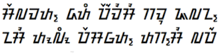
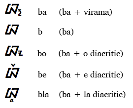

import ScriptDetails from '../../../../components/ScriptDetails.astro';
import ScriptResources from '../../../../components/ScriptResources.astro';
import WsList from '../../../../components/WsList.astro';

## Script details

<ScriptDetails />

## Script description

The Sundanese script is used to write the Sundanese language, spoken by about 27 million people on the Indonesian island of Java.

Read the full description...
Today, the language is generally written in either the Sundanese or the Latin script, but has historically also been written using other scripts. As of 1996, the Sundanese script has been the official script for the language; it is currently taught in schools and used for public signage.

It is an abugida of Brahmic descent. The standardized script contains 23 consonants, each bearing an inherent vowel, and 7 independent vowels, as well as digits from 0-9. Dependent vowels are represented by means of diacritics above, below or alongside the consonant, altering the inherent vowel. The consonants [ya], [ra] and [la] can also appear as diacritical marks when immediately following an initial consonant. 

Two additional characters were recently added to represent the sounds [kha] and [sya], found in Arabic loan words. A virama character (shown above) exists for cancelling the inherent vowel; this is a separate character/akśra which follows the consonant, so unlike the virama characters of many other Brahmic abugidas it does not enable the formation of consonant clusters. Latin punctuation is used. There are two systems for ordering of the alphabet, both based on the Brahmic order by place of articulation.

## Languages that use this script

:::note
A status of _obsolete_ indicates that the writing system is no longer in use for that language; the language may still be spoken.
:::

<WsList script='Sund' wsMax='5' />

## Unicode status

In The Unicode Standard, Sundanese script implementation is discussed in [Chapter 17 Indonesia and Oceania](http://www.unicode.org/versions/latest/ch17.pdf).

- [Full Unicode status for Sundanese](/scrlang/unicode/sund-unicode)

## Resources

<ScriptResources detailSummary='seemore' />

