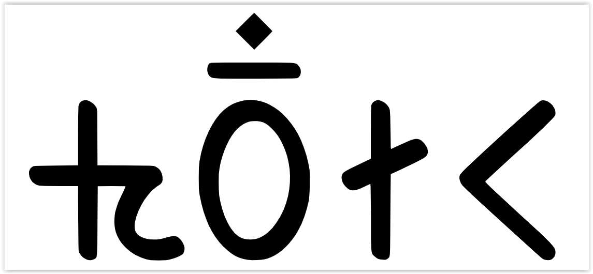

import ScriptDetails from '../../../../components/ScriptDetails.astro';
import WsList from '../../../../components/WsList.astro';
import ArticlesList from '../../../../components/ArticlesList.astro';
import SourceLinksList from '../../../../components/SourceLinksList.astro';
import BibList from '../../../../components/BibList.astro';

## Script details

<ScriptDetails />

## Script description

The Sunuwar script (previously name _Jenticha script_ and sometimes called _Kõits script_) is used for writing Sunuwar, a Tibeto-Burman language spoken by 40,000 people in eastern Nepal and by an unknown number in Sikkim, India.

Read the full description...
It is recognized in Sikkim as the Sunuwar script, and is taught in schools in the area and used for translating the proceedings of the Sikkim legislative assembly into Sunuwar. Sunuwar is also used to print a Sunuwar newspaper, for anthologies of Sunuwar poetry, and for academic works. The language can also be written in the [Devanagari](/scrlang/scripts/deva) and [Tikamuli](/scrlang/scripts/qa19) scripts.

The script was invented by Krishna Bahadur Jenticha in 1942. The shapes of some Sunuwar letters appear to have been based on Limbu and Latin characters, although it has no genetic relationship to any other writing system. The script is an alphabet with some alphasyllabic features.

Twenty-five consonant letters are used, all of which bear an inherent [a] vowel except for the glottal stop. This vowel can be changed by writing a vowel letter after the consonant; dependent vowel diacritics are not used. The inherent vowel can also be silenced using a _virama_ character. Consonant clusters are written using either the _virama_ or a half form of the initial letter(s).

At the time of its creation, the script was a pure alphabet and did not exhibit these alphasyllabic features.

## Languages that use this script

<WsList script='Sunu' wsMax='5' />

## Unicode status

In The Unicode Standard, Sunuwar script (formerly called Jenticha) implementation is discussed in [Chapter 13 South and Central Asia-II — Other Modern Scripts](https://www.unicode.org/versions/latest/core-spec/chapter-13/#G746336).

- [Full Unicode status for Sunuwar](/scrlang/unicode/sunu-unicode)

## Resources

<ArticlesList tag='script-sunu' header='Related articles' />

<SourceLinksList tag='script-sunu' header='External links' entrytype='online' />

<BibList tag='script-sunu' header='Bibliography' entrytype='non-online' />

