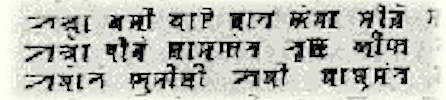

import ScriptDetails from '../../../../components/ScriptDetails.astro';
import WsList from '../../../../components/WsList.astro';
import ArticlesList from '../../../../components/ArticlesList.astro';
import SourcesList from '../../../../components/SourcesList.astro';
import Bibliography from '../../../../components/Bibliography.astro';

## Script details

<ScriptDetails />

## Script description

The Syloti Nagri script (also called Sylheti Nagri) is the original script for the Sylheti language, spoken in Bangladesh.

Read the full description...
The script has been almost entirely replaced by the Bengali and, to a lesser extent, Latin, scripts. At its peak however, it was used by all literate Sylheti speakers for personal correspondence, record-keeping, business purposes and religious texts in the language. Legend has it that the script was created by Saint Shah Jalal, who also converted the area to Islam, in the early 14th century. The script appears to be derived from the Kaithi script used in Bihar. The earliest extant manuscripts are dated to approximately the 17th century. By the end of the 17th century however, Persian had been declared the official language of the region, and the Perso-Arabic script was used in all official texts, although the Syloti Nagri script continued to be used informally. The first Syloti-Nagri printing press was established around 1870, and literacy in the script became high, but the script began to decline after the Partition of India in 1947, and by 1970 had fallen almost entirely from use.

The script is an abugida, that is, each letter represents a full syllable consisting of either a vowel or a consonant + [a] vowel sequence. Vowels other than [a] which follow a consonant are indicated by attaching a vowel diacritic to the base letter, which replaces the [a] sound with the desired vowel. There are 27 consonant+[a] letters, 5 vowel letters, and 5 vowel diacritics. Words which end with a consonant, that is, where the inherent [a] vowel needs to be silenced, are marked with a special diacritic called _hasanta_. Consonant clusters are written using conjuncts, comprising reduced forms of the letters.

An unusual feature of the script is that, although it is written from left to right, books are paginated from right to left, possibly due to the Arabic influence on writing. Syloti Nagri is also thought to be unique amongst Indic writing systems in allowing vowel + syllable ligatures, for example to represent [ama]. Most Indic scripts only allow consonant + syllable ligatures.

## Languages that use this script

:::note
A status of _obsolete_ indicates that the writing system is no longer in use for that language; the language may still be spoken.
:::

<WsList script='Sylo' wsMax='5' />

## Unicode status

In The Unicode Standard, Syloti Nagri script implementation is discussed in [Chapter 15: South and Central Asia-IV — Other Historic Scripts](https://www.unicode.org/versions/latest/core-spec/chapter-15/#G59104).

- [Full Unicode status for Syloti Nagri](/scrlang/unicode/sylo-unicode)

## Resources

<ArticlesList tag='script-sylo' header='Related articles' />

<SourcesList tag='script-sylo' header='External links' />

<Bibliography tag='script-sylo' header='Bibliography' />

