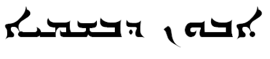

import ScriptDetails from '../../../../components/ScriptDetails.astro';
import ScriptResources from '../../../../components/ScriptResources.astro';
import WsList from '../../../../components/WsList.astro';

## Script details

<ScriptDetails />

## Script description

Estrangelo is the oldest form of the Syriac script.

Read the full description...
The earliest Syriac language inscriptions, dating from the 1st or 2nd century AD were written in a cursive Aramaic Palmyrene script. By the 5th century AD, when the oldest extant Syriac manuscript was written, this had developed into the more formalized Estrangelo script. Estrangelo is also the name for the classical Aramaic dialect of Edessa (now Sanliurfa, Turkey). This is the dialect which became the _lingua franca_ of ancient Christianity and which developed into the modern Syriac language.

Estrangelo writing was the sole Syriac script until the beginning of the 6th century, at which time a schism in the church led to the East and West Syrian Christians developing variant forms of the script. It continued to be used in manuscripts and ornate codices until the 8th century, after which point it fell into disuse. Since the 10th century some attempts have been made to revive the Estrangelo script, and it is sometimes used in scholarly texts, or for titles and inscriptions.

Estrangelo was written from right to left. It was a cursive script; most letters had a right-joining form to join to the preceding letter, and many had a left-joining form to join to the following letter. Twenty-two consonant letters were used, representing the same sounds as the Hebrew script. Two letters, _kap_ [k] and _nun_ [h] had a variant form when used at the beginning of a word, and two, _meem_ [m] and _simkath_ [s], had a variant form when used at the end.

Diacritics were used for differentiating between the letters _dalat_ [d] and _res_ [r], which had a similar shape. They were also used to indicate gender of a verb, plurality of a noun, and etymological information affecting pronunciation. The vowel pointing system used in many Semitic scripts is thought to have developed from this system of diacritics.

Estrangelo appears to have been the earliest Semitic script to include vowels, although it was most often written without them. The earliest manuscripts use only consonant letters, but it is believed that the use of Syriac to spread Christianity to other language groups necessitated the development of a vowel pointing system to clarify pronunciation.

## Languages that use this script

<WsList script='Syre' wsMax='5' />

## Unicode status

In The Unicode Standard, Syriac Script implementation is discussed in [Chapter 9 Middle East-I — Modern and Liturgical Scripts](https://www.unicode.org/versions/latest/core-spec/chapter-9/#G13005) and in [UTN 52: Christian Palestinian Aramaic (CPA) Encoding](https://www.unicode.org/notes/tn52/). The Unicode Syriac block combines all three main script variants (Estrangelo, Eastern and Western) in a single set of character codes.

- [Full Unicode status for Syriac](/scrlang/unicode/syrc-unicode)

## Resources

<ScriptResources detailSummary='seemore' />

