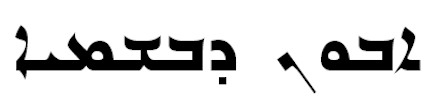

import ScriptDetails from '../../../../components/ScriptDetails.astro';
import ScriptResources from '../../../../components/ScriptResources.astro';
import WsList from '../../../../components/WsList.astro';

## Script details

<ScriptDetails />

## Script description

The Eastern Syriac script (also called Madnhaya, Swadaya, Assyrian, Chaldean, or Nestorian) is used for writing the East Syriac dialect, now extinct outside of the Syriac Church, and for the Eastern Neo-Aramaic languages Koy Sanjaq Surat, Senaya, and Hertevin.

Read the full description...
The script is closely related to the older Estrangelo style of Syriac writing, from which it is derived. Around the 6th century a schism in the Syrian church saw those in the West generally becoming Jacobite Christians and those in the East generally becoming Nestorian Christians. As the two groups diverged, so did their writing styles, until there were two distinct but related variants of the script.

Both East and West Syriac are written from right to left in a cursive style; most letters are joined on one or both sides to the letters around them. There are twenty-two letters in the inventory, all representing consonants. Three of these are _matres lectionis_, they can either represent the consonants [ʔ], [w] and [j], or the vowels [a], [u/o], [ɪ/e/ɛ] respectively. Eastern Syriac writing also employs a vowel pointing system developed from the Estrangelo system, whereby vowels are indicated using diacritics composed mainly of dots. Some vowels are written by adding a curved stroke to the consonant and writing the dot above/below that stroke.

Eastern Syriac writing also spread to Central Asia, where it was written vertically. The Mongolian, Manchu and Kalmuk scripts (also written vertically) are derived from this style of writing.

## Languages that use this script

<WsList script='Syrn' wsMax='5' />

## Unicode status

In The Unicode Standard, Syriac Script implementation is discussed in [Chapter 9 Middle East-I — Modern and Liturgical Scripts](https://www.unicode.org/versions/latest/core-spec/chapter-9/#G13005) and in [UTN 52: Christian Palestinian Aramaic (CPA) Encoding](https://www.unicode.org/notes/tn52/). The Unicode Syriac block combines all three main script variants (Estrangelo, Eastern and Western) in a single set of character codes.

- [Full Unicode status for Syriac](/scrlang/unicode/syrc-unicode)

## Resources

<ScriptResources detailSummary='seemore' />

