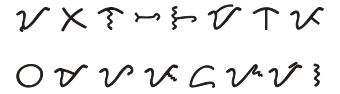

import ScriptDetails from '../../../../components/ScriptDetails.astro';
import ScriptResources from '../../../../components/ScriptResources.astro';
import WsList from '../../../../components/WsList.astro';

## Script details

<ScriptDetails />

## Script description

The Tagbanwa (also known as Apurahuano) script is one of the Brahmic scripts indigenous to the Philippines.

Read the full description...
It is used to write the Tagbanwa language, which is spoken by approximately 8,000 people living in scattered communities throughout the Palawan region. Although the language is used exclusively between speakers of Tagbanwa, younger generations prefer to use Tagalog in the company of other non-Tagbanwa Filipinos, as there is felt to be some stigma attached to the Tagbanwa identity. The result is that use of the language is declining, and, in keeping with that trend, literacy in the script is low. Of the three living indigenous Philippine scripts - Hanunoo, Buhid and Tagbanwa - Tagbanwa is acknowledged to be the least widely used.

The script is an abugida composed of 13 consonants. Each consonant has an inherent vowel [a], which can be modified to [i] or [u] by the addition of a diacritic, called _ulitan_, above or below the syllable respectively. There are also three vowel characters for representing syllable-initial vowels. There is no method for cancelling the inherent vowel, so syllable-final consonants are unexpressed in the Tagbanwa orthography and deduced from context. The script is read horizontally from left to right, but has historically been written either horizontally or vertically; in the case that it is written vertically, characters are oriented horizontally to facilitate reading.

## Languages that use this script

<WsList script='Tagb' wsMax='5' />

## Unicode status

In The Unicode Standard, Tagbanwa script implementation is discussed in [Chapter 17 Indonesia and Oceania](http://www.unicode.org/versions/latest/ch17.pdf) under Philippine scripts.

- [Full Unicode status for Tagbanwa](/scrlang/unicode/tagb-unicode)

## Resources

<ScriptResources detailSummary='seemore' />

