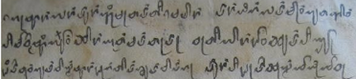

import ScriptDetails from '../../../../components/ScriptDetails.astro';
import WsList from '../../../../components/WsList.astro';
import ArticlesList from '../../../../components/ArticlesList.astro';
import SourcesList from '../../../../components/SourcesList.astro';
import Bibliography from '../../../../components/Bibliography.astro';

## Script details

<ScriptDetails />

## Script description

The Tai Le script has been used for 700-800 years for writing the Tai Le language (also known as Tai Nüa, Dehong Dai, Tai Mau, Tai Kong, and Chinese Shan), one of the official languages of Dehong in China.

Read the full description...
The language is also spoken in Thailand, Myanmar and Laos. The script was derived from the Brahmi script, which spread from India with the introduction of Buddhism to Southeast Asia. The script has undergone a number of progressive changes since its inception. In 1954 it was decided that the script was unsuitable for writing the language - there were multiple symbols for representing the same sound, tone was not being accurately represented, and there was no standard for joining the letters in handwritten form. A new version of the script was proposed, and revised again in 1988, in order to resolve some of these problems.

Like many scripts having Brahmic derivation, consonants contain an inherent 'a' vowel, which can be modified by the addition of diacritics. There are 19 consonant symbols and 11 vowels. Of the consonants, all but [n] can occur syllable-initially. Only unaspirated [p], [t] and [k], and the nasals [m], [n] and [ŋ] can occur syllable-finally. 6 tones are represented by 5 spacing marks which were introduced as part of the reform in 1988 (Tone 1 is represented by the absence of a tone mark.). Prior to this, diacritics were used for marking tone.

Both Chinese and Latin punctuation are used in writing Tai Le. In China, Latin digits are widely used, although a modified set of Myanmar digits is also used. It is believed that Tai Le writers in Myanmar use unique Tai Le digits.

The script is currently widely used in China for government documents, public notice boards and signage, in advertising, education and publishing. There are 6 publishing houses in China which publish over 45,000 book copies per year in the script. It is estimated that speakers of Tai Le in Dehong are about 95% literate in the Tai Le script.

## Languages that use this script

<WsList script='Tale' wsMax='5' />

## Unicode status

In The Unicode Standard, Tai Le script implementation is discussed in [Chapter 16: Southeast Asia-I — Thailand, Laos, Myanmar, Cambodia, Vietnam](https://www.unicode.org/versions/latest/core-spec/chapter-16/#G32903).

- [Full Unicode status for Tai Le](/scrlang/unicode/tale-unicode)

## Resources

<ArticlesList tag='script-tale' header='Related articles' />

<SourcesList tag='script-tale' header='External links' />

<Bibliography tag='script-tale' header='Bibliography' />

