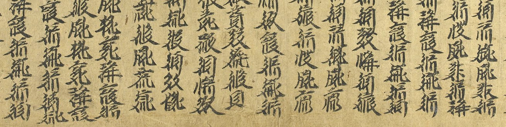

import ScriptDetails from '../../../../components/ScriptDetails.astro';
import WsList from '../../../../components/WsList.astro';
import ArticlesList from '../../../../components/ArticlesList.astro';
import SourcesList from '../../../../components/SourcesList.astro';
import Bibliography from '../../../../components/Bibliography.astro';

## Script details

<ScriptDetails />

## Script description

The Tangut script (also called Xixia) was widely used between 1036 and 1502 for writing the Tangut language, an extinct Tibeto-Burman language from China.

Read the full description...
The script was written with almost 6,000 characters. It was created at the decree of the emperor, and is thought to have been modelled on Chinese. However, although the overall look of the characters resembles Chinese writing, the two scripts are mutually illegible, and the stroke types are different. Another important difference between the two is that Tangut characters are wholly lacking in any pictographic basis, that is, the shapes of the characters are not modelled on the things or concepts that they represent. 

The majority of Tangut characters are composed of at least two distinct components. However, approximately forty have a unitary composition. Some analyses describe these as 'composite' and 'simple' characters, respectively. Simple characters represent either semantic or phonetic information, and can be modified and / or combined to create composite characters. For example, _ɣu_, meaning 'a supernatural being that flies' is written by combining the left side of the character representing 'emperor' with the left side of the character representing 'bird'. The result of this is that characters representing semantically related words also resemble each other visually, despite the lack of a pictographic basis to the characters. The mid 12th century Tangut rhyming dictionary, _The Sea of Characters_ (Wén Hǎi 文海 in Chinese), analyses each composite character in terms of other Tangut characters with which it shares (simple) constituent elements.

## Languages that use this script

<WsList script='Tang' wsMax='5' />

## Unicode status

In The Unicode Standard, Tangut script implementation is discussed in [Chapter 18: East Asia](https://www.unicode.org/versions/latest/core-spec/chapter-18/#G43635) and in [UTN 42: Tangut Character Additions and Glyph Corrections](https://www.unicode.org/notes/tn42/).

- [Full Unicode status for Tangut](/scrlang/unicode/tang-unicode)

## Resources

<ArticlesList tag='script-tang' header='Related articles' />

<SourcesList tag='script-tang' header='External links' />

<Bibliography tag='script-tang' header='Bibliography' />

