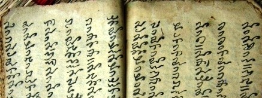

import ScriptDetails from '../../../../components/ScriptDetails.astro';
import ScriptResources from '../../../../components/ScriptResources.astro';
import WsList from '../../../../components/WsList.astro';

## Script details

<ScriptDetails />

## Script description

The Tai Yo script is used to write the Tai Yo language (also called Yoy, Tai Do, Tay Muoi, Tay Quy Chau, or Tay-Jo) spoken in Laos, Thailand and Vietnam.

Read the full description...
Most people use the Latin script, but the Tai Yo script does have limited use.

The script is written vertically, from top to bottom and from right to left. Books written in the script accordingly open on the left.

There are three types of consonant symbol in Tai Yo. Twenty-four symbols are used only at the start of a syllable. Five symbols are used only at the end of a syllable. Three symbols can be used either at the start or at the end of a syllable, although their position in the syllable dictates their pronunciation. At the start they represent [ɓ], [ƌ], [ɲ], but at the end they represent [p], [t], [j].

There is a tone mark for indicating tone.

Consonants do not contain an inherent vowel; all vowels are written explicitly by means of dependent symbols. There are 15 vowel symbols in total, 5 of which represent diphthongs. Vowels can be joined after (that is, below) a consonant, or to the right of it.

There are 5 (possibly 6) consonant+vowel ligatures, representing at, ak, am, an, ang, (ap).

One symbol can represent either one of a number of vowels, or the labialization of a consonant. When written below the consonant it represents the diphthong [ie] or [ia]; when it is both written to the right of the consonant and is syllable-final it represents [ăi]; when it is both written to the right _and_ is followed by a vowel it represents labialization. The exception to representing labialization with this symbol is [kw], which is written with a separate symbol.

## Languages that use this script

:::note
A status of _obsolete_ indicates that the writing system is no longer in use for that language; the language may still be spoken.
:::

<WsList script='Tayo' wsMax='5' />

## Unicode status

The Tai Yo  has been accepted for encoding in a future version of the Unicode standard. The script has a provisional allocation at U+1E6C0..U+1E6FF in the [Roadmap to the SMP](http://www.unicode.org/roadmaps/smp/) for the Unicode Standard.

- [Full Unicode status for Tai Yo](/scrlang/unicode/tayo-unicode)

## Resources

<ScriptResources detailSummary='seemore' />

