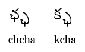
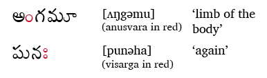

import ScriptDetails from '../../../../components/ScriptDetails.astro';
import ScriptResources from '../../../../components/ScriptResources.astro';
import WsList from '../../../../components/WsList.astro';

, via Gondwana, 2008. See Use and History subject area.")

## Script details

<ScriptDetails />

## Script description

The Telugu script is used for writing the Telugu language, a Dravidian language spoken by almost 70,000,000 people in South India.Telugu is the official language of the Indian state of Andhra Pradesh. The Telugu script is also used for writing a number of minority languages in Southern India, including Chenchu, Savara and Manna-Dora to which the Telugu language is related. The script is closely related to the Kannada script; a person familiar with one script can normally read the other. The two scripts developed from a common Brahmic source but diverged around the 13th century AD. From this time until the early 20th century, Telugu was a literary language - the written form reflected an archaic spoken form. Modern standard Telugu only began to be written during the second half of the 20th century.

Like most of the Brahmic-derived scripts, Telugu is an abugida written from left to right. Visually, it differs from many of the North Indian scripts in that the letters have a rounded base and the characteristic North Indic headstroke has been replaced by a hook on the top left of each letter. An inherent 'a' vowel is inherent in each of the thirty-two consonant symbols. Vowels other than 'a' are written using diacritics attached above, below or to the right of the consonant symbol. These vowel diacritics override the inherent vowel so that the syllable is read with the correct vowel sound. Where a vowel occurs at the start of a word, there is no preceding consonant symbol to which a diacritic may be attached, so one of sixteen independent vowel letters is used. (Two of these letters do not, strictly speaking, represent vowels, but long and short forms of the syllabic consonants [r̩] and [l̩].) A _halantamu_ symbol is written above a word-final consonant to silence the inherent vowel. This symbol can also be used for writing consonant clusters, when a ligature (described below) is not used.

Spoken Telugu contains a number of [geminates](/reference/glossary#gemination) (long consonants). Some consonant clusters are also used. Both of these are represented in writing using ligatures comprised of the full form of the first consonant and the half form of the second consonant. The half form of a letter is generally formed by stripping the letter of its top hook, and is subscribed below the preceding letter.

There are two additional symbols which are only written after vowels. The first is _anusvara_, a circle which either represents a nasal consonant pronounced at the same place in the oral cavity as the following consonant, or, where there is not following consonant, represents a final [m]. For example, the word [ʌŋgəmu] 'limb of the body' is written with _anusvara_ following the [ʌ] and the word [lʌga:m] 'bridle' with _anusvara_ following the [a:], although there are separate letters for representing the sounds [ŋ] and [m]. The second symbol is _visarga_, two small circles stacked in the manner of the dots in a Latin colon. This symbol is transcribed as ḥ and normally represents a post-vocalic [ha], as in the word 'again' written _punaḥ_ and pronounced [punəha].

Telugu writing employs a script-specific set of digits from 0-9. In the past, these were combined with eight arithmetic symbols for writing fractions. The system for writing fractions was complex, for example, 3/8 was written using four symbols representing 1, 1/4, 2 and 1/16 (i.e. 1 x 1/4 + 2 x 1/16). In modern texts, however, decimal fractions are used.

## Languages that use this script

<WsList script='Telu' wsMax='5' />

## Unicode status

In The Unicode Standard, Telugu script implementation is discussed in [Chapter 12 South and Central Asia-I — Official Scripts of India](https://www.unicode.org/versions/latest/core-spec/chapter-12/#G81985).

- [Full Unicode status for Telugu](/scrlang/unicode/telu-unicode)

Other:

- [Unicode status for Vedic](/scrlang/unicode/x-vedic-unicode)

## Resources

<ScriptResources detailSummary='seemore' />

