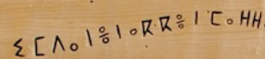

import ScriptDetails from '../../../../components/ScriptDetails.astro';
import ScriptResources from '../../../../components/ScriptResources.astro';
import WsList from '../../../../components/WsList.astro';

## Script details

<ScriptDetails />

## Script description

The Tifinagh alphabet is used to write the Berber languages spoken in North Africa; it is believed to be a form of the Ancient Berber script.

Read the full description...
It is widely used by the Tuareg, the principal inhabitants of the Saharan interior.

There are many regional variations of the script; the standardised version proposed by the Institut Royal de la Culture Amazighe (IRCAM) consists of 33 symbols. This character set does not represent the full phonemic inventory of any particular language, but was proposed with a view to progressively unifying regional phonological variations in the orthography. Consonant [gemination](/reference/glossary#gemination) is represented by writing the letter twice. Traditionally, vowels are only written word-finally, although in some areas Arabic diacritics are adopted to represent word-internal vowels. Some Tuareg orthographies use diacritics from the "Combining Diacritics" Unicode block. Some texts also employ a number of conjunct forms in order to differentiate between words which would otherwise be ambiguous due to the vowels being unwritten. Historically, the script has been written in any direction, horizontally or vertically, although today it tends to be written by the Tuaregs horizontally from right to left, and by the Berbers from left to right. Words are separated by spaces and Latin punctuation is generally used, although in some areas a _tazarast_ symbol is used for phrase and sentence breaks.

The Tifinagh script as regulated by IRCAM has officially been the only writing system for transcribing the Tamazight language in Morocco since 2003. The script also remains widely used in Algeria, Mali and Niger; however, it is generally used alongside the Latin or Arabic alphabets. Public use of the script was banned in Libya under Colonel Gaddafi's regime, but the interim government, the National Transitional Council, appears to be more open to it.

Tifinagh is also sometimes known by the name of the language or the people using it, for example Tuareg or Berber. It is also referred to as Neo-Tifinagh to distinguish it from the old Berber abjad, Tifinagh.

## Languages that use this script

:::note
Languages listed as _unwritten_ would likely use Tifinagh script if a writing system were developed. 
:::

<WsList script='Tfng' wsMax='5' />

## Unicode status

In The Unicode Standard, Tifinagh script implementation is discussed in [Chapter 19 Africa](https://www.unicode.org/versions/latest/core-spec/chapter-19/#G43184) and in [UTN 59: Representing Tifinagh in Unicode](https://www.unicode.org/notes/tn59/).

- [Full Unicode status for Tifinagh](/scrlang/unicode/tfng-unicode)

Other:

- [Unicode status for Combining marks](/scrlang/unicode/x-comb-marks-unicode)

## Resources

<ScriptResources detailSummary='seemore' />

