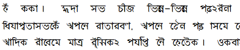

import ScriptDetails from '../../../../components/ScriptDetails.astro';
import ScriptResources from '../../../../components/ScriptResources.astro';
import WsList from '../../../../components/WsList.astro';

## Script details

<ScriptDetails />

## Script description

The Tirhuta (also called Mithilakshar) script has historically been used for writing the Maithili language, an Indo-Aryan language spoken by almost 35 million people.

Read the full description...
Maithili is spoken predominantly in the state of Bihar in India and in the Narayani and Janakpur zones of Nepal. Nowadays, the Maithili language is written almost exclusively in the Devanagari script, although Tirhuta is still sometimes used by religious pundits for writing ceremonial letters and documents, and efforts are underway to broaden the scope of its usage. These efforts were aided in 2003 when the Government of India included Maithili in the Eighth Schedule of the India Constitution as a scheduled language, thus ensuring official support for its development, and in 2011 when the script was accepted into ISO 15924.

The Tirhuta script is an abugida written from left to right. There are eighty-two characters in the script, comprising thirty-three consonant letters, fourteen independent vowel letters, fifteen dependent vowel diacritics, five non-alphabetic signs, three punctuation symbols, two sacred signs and ten digits (0-9). Many letters and conjuncts also have variant forms. The letters hang from a baseline, with diacritics written above the baseline, or below or beside the letter. It is similar to the Bengali script, but forms a number of conjuncts differently. Also, there are some visually identical signs which represent different sounds in the two scripts, which impedes mutual legibility of the two scripts.

## Languages that use this script

:::note
A status of _obsolete_ indicates that the writing system is no longer in use for that language; the language may still be spoken.
:::

<WsList script='Tirh' wsMax='5' />

## Unicode status

In The Unicode Standard, Tirhuta script implementation is discussed in [Chapter 15: South and Central Asia-IV — Other Historic Scripts](https://www.unicode.org/versions/latest/core-spec/chapter-15/#G95493).

- [Full Unicode status for Tirhuta](/scrlang/unicode/tirh-unicode)

## Resources

<ScriptResources detailSummary='seemore' />

