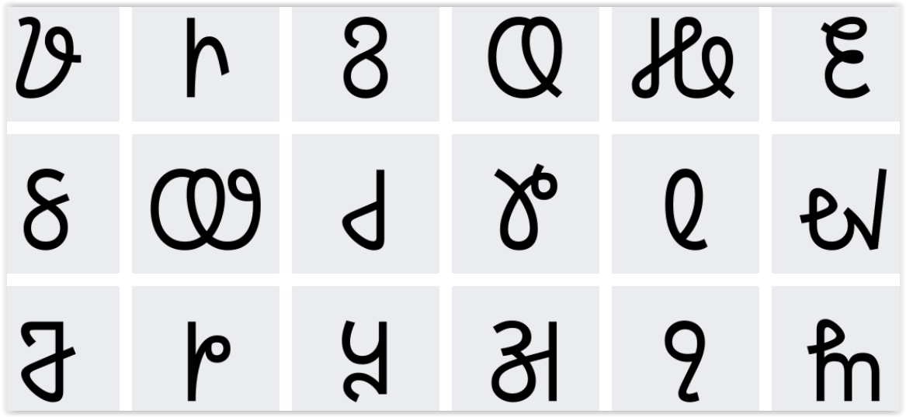

import ScriptDetails from '../../../../components/ScriptDetails.astro';
import ScriptResources from '../../../../components/ScriptResources.astro';
import WsList from '../../../../components/WsList.astro';

## Script details

<ScriptDetails />

## Script description

The Tangsa (also called Tangshang or Hawa) are a cluster of about 70 sub-tribes who live along the border of India and Myanmar.

Read the full description...
There are just under 100,000 people classed in this people group, approximately ¾ of whom are in Myanmar and ¼ are in India. It is believed that they migrated from the Indo-Tibetan plateau (what is now Mongolia) in the 12th or 13th century. They speak a number of linguistic varieties which are grouped together under the name Tase Naga and given the ISO code "nst". Although these are currently officially classed as one language, in practice many of them function as separate languages, with the level of mutual intelligibility in some cases as low as 35%. There is also a ‘song language’, which seems to be more or less the same across the sub-tribes. The question of whether a single language classification is appropriate for the Tangsa peoples is discussed further by Dr. Stephen Morey in _Can a ‘Common Language’ work for the Tangsa?_.

The traditional Tangsa belief is that the creator, Lord Rangfraa, gave their ancestors a writing system on deerskin, but they ate it and the script was lost. This is seen as a great loss, and the Tangsa are largely very interested in orthography and literacy development. In recent years, a number of orthographies have been proposed for the Tangsa languages, predominantly based on the Latin script.

Lakhum Mossang developed this script (originally known as the Mossang script) in 1990; it is genetically unrelated to any pre-existing scripts. It contains 73 characters, three of which are combining marks, and a set of digits from 0-9. The Mossang variety of the Tangsa language is tonal, and this is reflected in the script by each vowel having four different characters assigned to it, one for each tone. This means that tone is always marked in the writing. It also means that an unusually large proportion of characters in the script (43 of the 73) represent vowels.

(Note that this script is unrelated to the [Khimhun Tangsa](/scrlang/scripts/qa57) script, which is used for writing the same language(s).)

## Languages that use this script

<WsList script='Tnsa' wsMax='5' />

## Unicode status

In The Unicode Standard, Tangsa script implementation is discussed in [Chapter 13 South and Central Asia-II — Other Modern Scripts](https://www.unicode.org/versions/latest/core-spec/chapter-13/#G51897).

- [Full Unicode status for Tangsa](/scrlang/unicode/tnsa-unicode)

## Resources

<ScriptResources detailSummary='seemore' />

