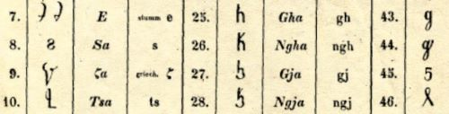

import ScriptDetails from '../../../../components/ScriptDetails.astro';
import WsList from '../../../../components/WsList.astro';
import ArticlesList from '../../../../components/ArticlesList.astro';
import SourceLinksList from '../../../../components/SourceLinksList.astro';
import BibList from '../../../../components/BibList.astro';
import Attribution from '/src/components/Attribution.astro';
import CaptionText from '/src/components/CaptionText.astro';

<CaptionText text="View of the letter of Todhri alphabet, as shown by George Von Hahn in 1854."/>
<Attribution
    type="Image"
    copyholder=""
    copyurl=""
    copyyears=""
    license="Public Domain"
    licenseurl=""
    author=""
    source="Wikimedia"
    sourceurl="https://commons.wikimedia.org/wiki/File:Todhri_alphabet_according_to_Johann_Georg_von_Hahn_1854.jpg"
/>

## Script details

<ScriptDetails />

## Script description

Todhri script is attributed to Theodor Haxhifilipi of Elbasan in central Albania, and was used to write the Albanian language.

Todhri consists of 52 characters.

Read the full description...
Todhri was used in the 18th  and the 19th centuries to write Biblical texts. Merchants also used the script for correspondence and record-keeping.

## Languages that use this script

<WsList script='Todr' wsMax='5' />

## Unicode status

In The Unicode Standard, Todhri script implementation is discussed in [Chapter 8 Europe-II — Ancient and Other Scripts](https://www.unicode.org/versions/latest/core-spec/chapter-8/#G746332).

- [Full Unicode status for Todhri](/scrlang/unicode/todr-unicode)

## Resources

<ArticlesList tag='script-todr' header='Related articles' />

<SourceLinksList tag='script-todr' header='External links' entrytype='online' />

<BibList tag='script-todr' header='Bibliography' entrytype='non-online' />
