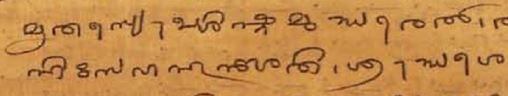

import ScriptDetails from '../../../../components/ScriptDetails.astro';
import WsList from '../../../../components/WsList.astro';
import ArticlesList from '../../../../components/ArticlesList.astro';
import SourcesList from '../../../../components/SourcesList.astro';
import Bibliography from '../../../../components/Bibliography.astro';

## Script details

<ScriptDetails />

## Script description

The Tulu-Tigalari script has been used since at least the 14th century (and, many scholars believe, much earlier than this) for writing the Tulu language.

Read the full description...
Tulu speakers generally refer to the script using the name _Tigalari_, rather than Tulu.  Tulu is a Dravidian language spoken by almost 2 million people in the South Indian states of Karnataka (coastal region) and Kerala (Kasaragod district). In the northern parts of the Tulu-speaking region the language carries considerable prestige and is used as a _lingua franca_ amongst educated people, but in the southern areas it is not so well respected. The northern dialect is considered to be the standard form.

The Tulu language is often referred to as a language having no script of its own, but this is misleading. There are a number of ancient manuscripts, most notably the Hindu _Mahabharata_ and some epic poems, written in the Tigalari script, although Tulu is now written almost exclusively in the Kannada script. As well as being used for the recording of long religious texts and poems, the script was widely used for writing Hindu mantras. The gradual demise of the Tigalari script has largely been attributed to Christian missionaries to South India who published a large body of literature in the Tulu language, using the Kannada script, the closest script with printing facilities. By the late 19th century the Tigalari script was considered to be endangered, and there are currently no known publishers who publish in the script. Literacy in the script is also low.

The script is an abugida written from left to right. Each of the thirty-five consonant letters represents a syllable in which the default vowel is [a]. This vowel can be changed by means of vowel diacritics appended beside, below, or in a combination of positions relative to the consonant letter. There are ten diacritics for this purpose. Vowels which cannot be attached to a preceding consonant letter (namely those at the start of a word) are written using one of eleven independent vowel letters.

Diphthongs are not used in speech, so are not represented in writing. Consonant clusters are not used at the start of Tulu words but are found word-internally and at the start of loan words. These are written using a _virama_ symbol which silences the inherent vowel in all but the final consonant in the cluster.

## Languages that use this script

<WsList script='Tutg' wsMax='5' />

## Unicode status

In The Unicode Standard, Tulu-Tigalari script implementation is discussed in [Chapter 15 South and Central Asia-IV — Other Historic Scripts](https://www.unicode.org/versions/latest/core-spec/chapter-15/#G746412).

- [Full Unicode status for Tulu-Tigalari](/scrlang/unicode/tutg-unicode)

## Resources

<ArticlesList tag='script-tutg' header='Related articles' />

<SourcesList tag='script-tutg' header='External links' />

<Bibliography tag='script-tutg' header='Bibliography' />

