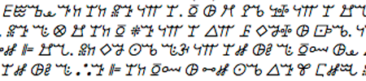

import ScriptDetails from '../../../../components/ScriptDetails.astro';
import ScriptResources from '../../../../components/ScriptResources.astro';
import WsList from '../../../../components/WsList.astro';

## Script details

<ScriptDetails />

## Script description

The Vai script was created by Mɔmɔlu Duwalu Bukɛlɛ in the 1830s to represent the Vai language spoken by about 104,000 in what is now Liberia, and about 15,000 in Sierra Leone.

Read the full description...
Tradition states that, while Bukɛlɛ was working as a messenger on a Portuguese ship, he became curious about the written messages he carried, which enabled the recipients to understand the captain's wishes without hearing his spoken words. When he returned home, he had a dream in which a tall white man revealed a number of symbols which could be used to write the Vai language. Upon waking, he wrote these symbols down.

An alternative theory proposes that the Vai syllabary was influenced by the Cherokee syllabary, to which it bears remarkable similarities. After the creation of the Cherokee syllabary in the early 1800s a number of Cherokee emigrated to West Africa. One particular Cherokee man, Austin Curtis, married into an influential family and became a chief himself. It is proposed that he might have contributed to the creation of the Vai script and influenced its form.

In the 1960s Momolu Massaquoi at the University of Liberia proposed further minor modifications to some characters, to enable every legitimate syllable to be represented, and, largely as a result of his efforts and those of August Klingenheben, in 1962 the script was standardised.

The script comprises 212 symbols, with every syllable in use being represented by a unique character. Forty or fifty of these characters are in much wider use than the others; many literates in fact find fifty characters adequate for their purposes. Although some glyphs representing a common place of articulation are related, there is no referable derivation of form or predictable application of diacritics. Tone is not represented, although Vai is a tonal language.

The script is a moraic syllabary. That is to say, rather then each symbol expressing one syllable, each symbol expresses one mora. The spoken language adheres to a strict (C)V(N) pattern, and the script reflects this. CV syllables containing a short vowel are monomoraic and written with a single character, and those containing a long vowel or diphthong are bimoraic and written with two characters. Closed CVN syllables are also bimoraic and written with two characters, as the nasal itself constitutes a mora. It should be mentioned that there is some variation in the way long vowels and diphthongs are syllabified, and therefore written/spelled.

Vai is written from left to right, but it is suggested that at one time it was also written from right to left or vertically from top to bottom. Vai-style numerals were proposed in the 1920s, but these were not popular and have never been widely attested. The 1962 Standard used a system of Vai punctuation, which is still used, but in combination with Latin punctuation according to personal preference. Older texts also attest to a set of logograms, although only two of these are still in use. Texts are currently published with breaks between words.

Bukɛlɛ established schools throughout the Vai-speaking region to propagate his script, and literacy became widespread; by 1899 most of the Vai were said to be literate. During the C20th a lengthy manuscript was published, detailing clan histories, Biblical and Qur'anic translations, and folktales. There continues to be a market for Vai literature; The Institute for Liberian Languages publishes in the script. It is also widely used in commerce, as well as for newspapers, tombstones and in traditional rituals.

## Languages that use this script

<WsList script='Vaii' wsMax='5' />

## Unicode status

In The Unicode Standard, Vai script implementation is discussed in [Chapter 19:Africa](https://www.unicode.org/versions/latest/core-spec/chapter-19/#G18604).

- [Full Unicode status for Vai](/scrlang/unicode/vaii-unicode)

## Resources

<ScriptResources detailSummary='seemore' />

