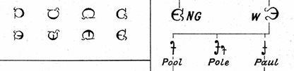

import ScriptDetails from '../../../../components/ScriptDetails.astro';
import WsList from '../../../../components/WsList.astro';
import ArticlesList from '../../../../components/ArticlesList.astro';
import SourcesList from '../../../../components/SourcesList.astro';
import BibList from '../../../../components/BibList.astro';

## Script details

<ScriptDetails />

## Script description

Visible Speech (also called the Physiological Alphabet) was invented in the 1860s by Alexander Melville Bell.

Read the full description...
Bell studied the science of speech as a young man, and went on to teach elocution at the University of Edinburgh, and later taught deaf-mutes in Washington DC.

He devised Visible Speech as a means of visually representing every human speech sound, for use in teaching deaf-mutes to speak. Each symbol was intended to reduce speech sounds to an unambiguous representation by showing the position and movement of the lips, tongue, and throat in producing them.

Bell also proposed that the script could be used to teach illiterates overseas to read and write their own languages, to communicate the exact sounds of foreign languages to students, for use in speech therapy, for diffusion of a primary language throughout the colonies, and possibly for the eventual establishment of a universal language.

Consonant and vowel symbols in Visual Speech contrast visually, with consonants being written using x-height curves representing the back, top, and tip of the tongue, and the lips. For example, curves turned to the right (that is, facing the same direction as a closing bracket) represent labial consonants such as [b], [p] etc., and curves turned to the left (that is, facing the same direction as a Latin letter _c_) represent consonants pronounced using the back of the tongue such as [k], [g] etc. Vowels are written using long thin symbols which either ascend above the x-height (for high vowels) or descend below the baseline (for low vowels) or do both (for mid-vowels). Glides and diphthongs are also represented.

There is also a set of modifiers representing features such as _nasal_, _stop_, _abrupt_ etc.

Bell’s son, Alexander Graham Bell, was also a big advocate of the script and contributed much of the profit from his patent of the telephone to promoting it.

## Languages that use this script

<WsList script='Visp' wsMax='5' />

## Unicode status

Visible Speech is not part of the Unicode Standard. However the [ConScript Unicode Registry (CSUR)](http://www.evertype.com/standards/csur/) has defined a range of the Unicode Private Use Area for Visible Speech. CSUR unoficially coordinates artificial/constructed scripts, which facilitates font development and interoperability.

- [Full Unicode status for Visible Speech](/scrlang/unicode/visp-unicode)

## Resources

<ArticlesList tag='script-visp' header='Related articles' />

<SourcesList tag='script-visp' header='External links' entrytype='non-online' />

<BibList tag='script-visp' header='Bibliography' entrytype='non-online' />

