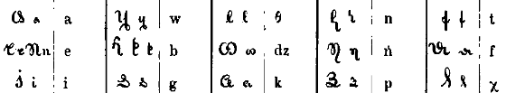

import ScriptDetails from '../../../../components/ScriptDetails.astro';
import ScriptResources from '../../../../components/ScriptResources.astro';
import WsList from '../../../../components/WsList.astro';

## Script details

<ScriptDetails />

## Script description

Büthakukye was an alphabetic script invented around 1840 for writing the Albanian language.

Read the full description...
It is sometimes called Veqilharxhi, after its inventor, Naum Veqilharxhi, or Vithkuqi, after his birthplace, the village of Vithkuq. The script was written from left to right using thirty-two characters. It is no longer used.

_This script is not currently recognized by the [ISO 15924 standard](http://www.unicode.org/iso15924/), but is included in ScriptSource for research purposes. If you have any information on this script, please add the information to this site. Your contributions can be a great help in refining and expanding the ISO 15924 standard. The [Script Encoding Initiative](http://www.linguistics.berkeley.edu/sei/) is working to support the inclusion of this script in the standard, and contributions here will support their efforts._

## Languages that use this script

:::note
A status of _obsolete_ indicates that the writing system is no longer in use for that language; the language may still be spoken.
:::

<WsList script='Vith' wsMax='5' />

## Unicode status

The Vithkuqi (Veqilharxhi or Büthakukye) script is not yet in Unicode. The script has a tentative allocation at U+10570..U+105BF in the [Roadmap to the SMP](http://www.unicode.org/roadmaps/smp/) for the Unicode Standard.

- [Full Unicode status for Vithkuqi](/scrlang/unicode/vith-unicode)

## Resources

<ScriptResources detailSummary='seemore' />

