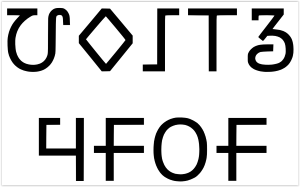

import ScriptDetails from '../../../../components/ScriptDetails.astro';
import ScriptResources from '../../../../components/ScriptResources.astro';
import WsList from '../../../../components/WsList.astro';

## Script details

<ScriptDetails />

## Script description

The Warang Citi script is used for writing the Ho language spoken largely in the state of Jharkhand in eastern India.

Read the full description...
The history of the script is controversial. Followers of Lako Bodra, an influential community leader who is variously credited with the invention or the rediscovery of the script, claim a much older heritage for the script than scholars have evidence for. The script displays a number of similarities with other scripts including Latin and Brahmi; Bodra's followers claim that this is the result of borrowing _from_ Warang Citi but scholars generally believe it is the result of borrowing _into_ it. The version of the script which has been most well-documented is based on an archaic (perhaps secret shamanistic) dialect of Ho called Ho Hayam, not the more widely-spoken dialect, Ho Kaji.

There are thirty-one letters in the script, twenty-one consonants and ten vowels, each of which also has a cursive form. The letters are arranged in rows and columns according to their phonetic properties; from top to bottom: velars, palatals, retroflex, dentals, labials, and from left to right: nasals, voiceless stops, voiced stops. There is no distinction made between aspirated and non-aspirated stops, either in speech or writing. Some letters appear to be redundant, for example the retroflex [ʂ] is not used in speech but there is a letter to represent it in writing. The names of the letters are written using consonant clusters, but pronounced in CVC form, for example _hl_ which is pronounced [hol]. Both of these features are thought by some scholars to be attempts by Bodra to 'sanskritize' the script.

Warang Citi is written from left to right. Consonants contain an inherent vowel; this is normally transcribed _a_ but can be pronounced variously as [a], [o], [e] or [ə]. Vowels other than the inherent vowel are written to the right of a preceding consonant using one of ten independent vowel letters. Unlike many of the South Asian abugidas, vowel diacritics are not used.  One of the vowel letters corresponds to the Devanagari _anusvara_ diacritic, marking nasalization. Two vowel letters, _i_ and _u_, have long counterparts but apart from these, vowel length is indicated by writing the letter _h_ after the vowel.

The Ho language employs two preglottalized stops, ['b] and ['ḍ] in word-final position. Preglottalization is not marked in writing, which leads to some ambiguity in loan words which have retained their native phonology and in which final [b] and [ḍ] are not glottal. Some ambiguity also arises in the case of consonant clusters. Ligated conjunct letters are not used, nor is any _virama_ for killing the inherent vowel, so there is no way of knowing whether a written sequence of consonant letters represents a CVC(V) string or a CC(V) cluster, without knowing the word.

The sequence _hb_ represents either [b] or [v], often transliterated _w_. [b] can also be written with the letter _b_; the reason for having an alternative representation is unknown. It is possible that the use of _hb_ marks the word as 'sacred' semantically rather than (or as well as) conveying phonological information. It is also possible that it reflects archaic pronunciation of some words.

There is a set of script-specific Warang Citi numerals from 0-9, and for multiples of 10 up to 100. These are not always used consistently however; the number 23 for example can be written either with the characters _20_ and _3_ or with _2_ and _3_.

## Languages that use this script

<WsList script='Wara' wsMax='5' />

## Unicode status

In The Unicode Standard, Warang Citi script implementation is discussed in [Chapter 13: South and Central Asia-II — Other Modern Scripts](https://www.unicode.org/versions/latest/core-spec/chapter-13/#G27702).

- [Full Unicode status for Warang Citi](/scrlang/unicode/wara-unicode)

## Resources

<ScriptResources detailSummary='seemore' />

