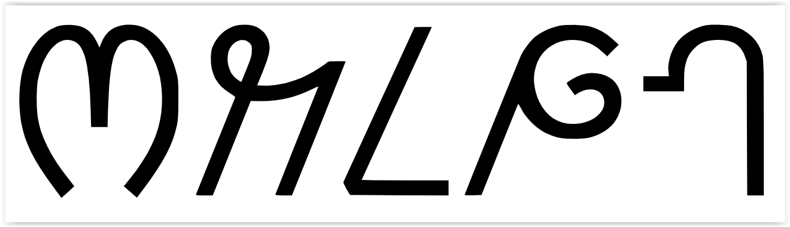

import ScriptDetails from '../../../../components/ScriptDetails.astro';
import WsList from '../../../../components/WsList.astro';
import ArticlesList from '../../../../components/ArticlesList.astro';
import SourcesList from '../../../../components/SourcesList.astro';
import Bibliography from '../../../../components/Bibliography.astro';

## Script details

<ScriptDetails />

## Script description

The Wancho script is used to write the Wancho language spoken in India.

Read the full description...
It is a simple alphabetic script comprised of letters which represent both consonants and vowels. There are no conjunct characters. Diacritical marks are used on vowel letters to indicate tone. The Wancho script has its own set of digits. Punctuation marks such as comma, full stop and question mark, are commonly used. 

The Wancho script was developed between 2001 and 2012 by Mr Banwang Losu. A font has been created for it and one book has been published using the script.

## Languages that use this script

<WsList script='Wcho' wsMax='5' />

## Unicode status

In The Unicode Standard, Wancho script implementation is discussed in [Chapter 13: South and Central Asia-II — Other Modern Scripts](https://www.unicode.org/versions/latest/core-spec/chapter-13/#G46061).

- [Full Unicode status for Wancho](/scrlang/unicode/wcho-unicode)

## Resources

<ArticlesList tag='script-wcho' header='Related articles' />

<SourcesList tag='script-wcho' header='External links' />

<Bibliography tag='script-wcho' header='Bibliography' />
