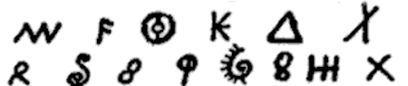

import ScriptDetails from '../../../../components/ScriptDetails.astro';
import ScriptResources from '../../../../components/ScriptResources.astro';
import WsList from '../../../../components/WsList.astro';

## Script details

<ScriptDetails />

## Script description

The Woleai script was used until the mid-20th century for writing the Woleaian language, a Micronesian language spoken by approximately 1,600 people in the Caroline Islands.

Read the full description...
The origin of the script is not known, although some letters appear to be Latin-based. It is thought that this came about after a European missionary, Alfred Snelling, became lost at sea and landed on one of the Caroline Islands in 1905. There is some debate as to whether the Woleaian people already had a writing system prior to Snelling's arrival, into which they integrated some Latin-based characters, or whether they adopted his system and augmented and modified it using other symbols. 

The script is a syllabary containing 98 characters. It is written from left to right, often without interword spacing. No ligation or shaping behaviour is present. Consonant and vowel length, which are distinctive in spoken Woleaian, are not represented in writing.

Usage of the script began to decline in the 1950s, and a Latin orthography is now used for writing Woleaian.

## Languages that use this script

:::note
A status of _obsolete_ indicates that the writing system is no longer in use for that language; the language may still be spoken.
:::

<WsList script='Wole' wsMax='5' />

## Unicode status

The Woleai script is not yet in Unicode. The script has a tentative allocation at U+16B90..U+16BFF in the [Roadmap to the SMP](http://www.unicode.org/roadmaps/smp/) for the Unicode Standard.

- [Full Unicode status for Woleai](/scrlang/unicode/wole-unicode)

## Resources

<ScriptResources detailSummary='seemore' />

